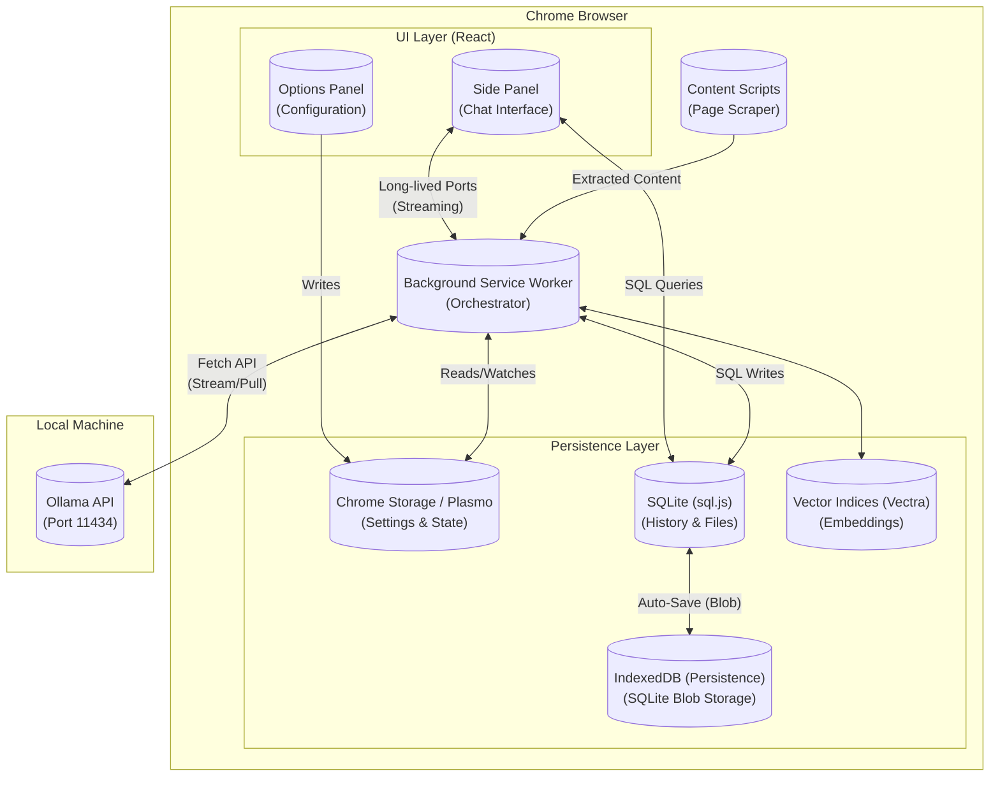
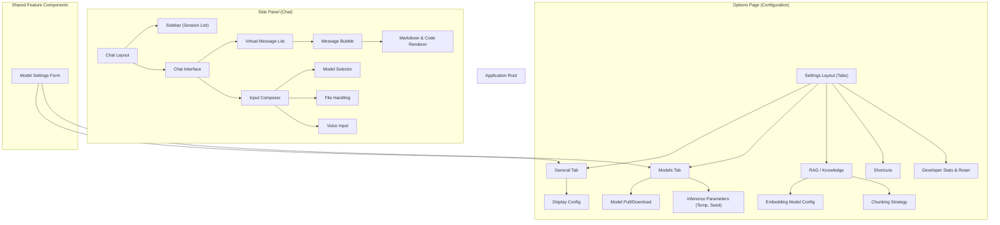
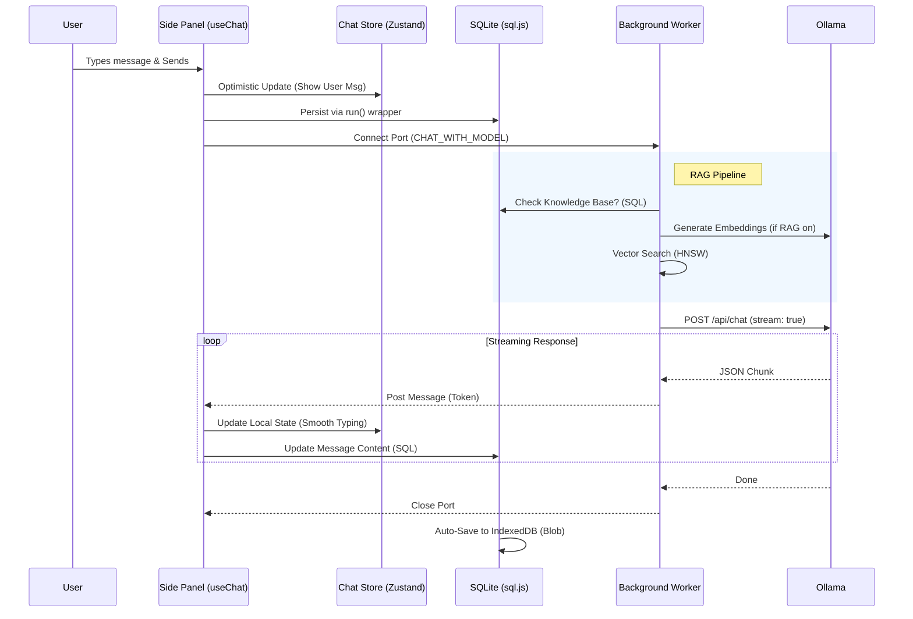

# Architecture Documentation

## 1. System Overview

The **Ollama Client** is a privacy-first Chrome Extension designed to interact directly with a local Ollama instance. It leverages a **Browser-Centric Architecture**, essentially operating as a "Thick Client" within the browser. The system eliminates the need for an intermediate backend server, communicating directly from the extension to the local Ollama API.

The architecture is composed of three primary execution contexts:

1.  **Side Panel (Main UI)**: The primary interface for chat, residing in the browser's side panel. It manages session state, message rendering, and user input.
2.  **Options Configuration (Settings)**: A dedicated page for deep configuration (Models, RAG, Knowledge Base, Shortcuts). It interacts heavily with the global storage to persist user preferences.
3.  **Background Service Worker**: The "Brain" of the extension. It handles long-running tasks (model pulling, embedding generation), manages the persistent connection to Ollama, and coordinates between the Side Panel and Content Scripts.

---

## 2. Component Hierarchy

The application follows a **Domain-Driven Design (DDD)** approach where features are encapsulated in `src/features/`. The UI is split between the **Side Panel** (Chat focus) and **Options Page** (Management focus).

---

## 3. Data Flow

### 3.1. Chat Interaction (Streaming)
The chat flow involves a complex coordination between the UI (for responsiveness) and the Background/DB (for persistence).

### 3.2. Configuration Propagation
Settings changes in the Options page are reactive.

1.  **User Change**: User selects a new "Embedding Model" in Options.
2.  **Storage Update**: `useStorage` hook updates `plasmo-global-storage`.
3.  **Background Reaction**: Background worker (listening to storage changes) detects the change.
4.  **Action**: If the model isn't downloaded, Background initiates a silent pull of the new embedding model.
5.  **State Sync**: UI sees the status change via the shared storage hook.

---

## 4. Core Features Breakdown

### 4.1. Model Management (The "Ollama Manager")
The extension acts as a full GUI for Ollama operations.
-   **Discovery**: Queries `localhost:11434/api/tags` to list local models.
-   **Library**: `src/features/model` contains components for pulling, deleting, and detailed inspection of models.
-   **Pulling Mechanism**: Implemented in `handleTheModelPull` using `fetch` streams. It supports resuming and cancellation via `AbortController`.

### 4.2. "Zero-Server" RAG (Retrieval-Augmented Generation)
A complete RAG pipeline running in the browser.
-   **Ingestion**: `file-processors` (PDF, Docx, HTML) extract raw text.
-   **Chunking**: Recursive character text splitter adapts chunk size based on content.
-   **Vector Store**: Uses **Vectra** (for persistent storage) or **MiniSearch** (for keyword storage).
-   **Hybrid Search**: Combines Scalar (Keyword) search with Vector (Semantic) search for higher accuracy.

### 4.3. Persistence Strategy
-   **SQLite (sql.js)**: Primary relational storage.
    -   `sessions`: Normalized session metadata.
    -   `messages`: Tree-based message storage (supports branching).
    -   `files`: Binary data for attachments.
-   **IndexedDB (Persistence)**: Used strictly as a blob store for the SQLite database file to ensure persistence across browser restarts.
-   **Chrome Storage**: Configuration and lightweight state (active tab, theme).

---

## 5. Security & Privacy

### "Zero-Cloud" Guarantee
The pivotal design choice of this application is **Local-Only Execution**.
-   **No Analytics**: The source code contains no analytics SDKs (Google Analytics, Mixpanel, etc.).
-   **Direct LAN Access**: Interaction is strictly `Browser <-> Localhost`.
-   **DOM Access**: `host_permissions` are used strictly for the "Read Page" feature, initiated by user action.

### Content Security Policy (CSP)
The extension relies on the relaxation of CSP for `localhost` connections to allow communication with the Ollama API, which is standard for local AI tools.
