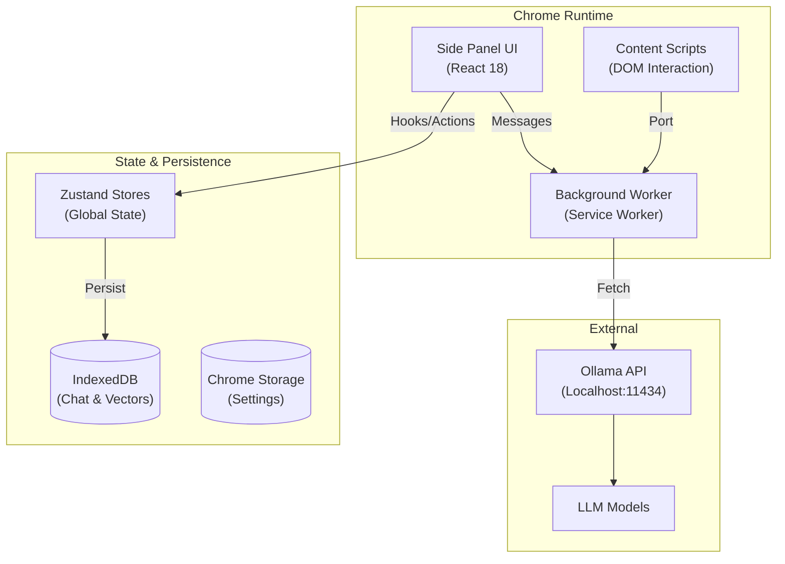

# 🏗️ Architecture Documentation

> **Version**: 0.5.10
> **Last Updated**: December 18, 2025

**Ollama Client** is a local-first, privacy-focused Chrome Extension that interfaces with a local Ollama instance. It features a sophisticated architecture typically found in full-scale web applications, including client-side vector search, normalized database with tree-based history, and virtualized lists.

---

## 📐 System Overview

The application is built on the **Plasmo** framework (Manifest V3) and employs a modular "feature-slice" architecture.



---

## 🧩 Core Architecture

### 1. Feature-First Directory Structure
We organize code by business domain rather than technical layer. This ensures scalability and cohesive maintenance.

```
src/
├── features/             # Domain Logic
│   ├── chat/             # Message bubbles, list virtualization, input
│   ├── model/            # Model pulling, selection, settings
│   ├── knowledge/        # RAG, Vector Search UI, Indexing
│   ├── file-upload/      # File processors (PDF/DOCX/CSV)
│   └── sessions/         # Session management, history tree
├── lib/                  # Shared Infrastructure
│   ├── db.ts             # Database Schema & Migrations
│   ├── embeddings/       # HNSW Vector Store Implementation
│   └── exporters/        # PDF/JSON/MD Export Logic
├── stores/               # Global State (Zustand)
└── background/           # Service Worker Handlers
```

### 2. Message Passing Bus
The UI communicates with the Background Worker via a typed message bus (`src/lib/constants.ts`). This offloads heavy tasks (scraping, model inference) from the UI thread.
*   **Pattern**: `sendMessage({ type: "ACTION", payload })` -> `Handler` -> `sendResponse`.
*   **Streaming**: Uses `Port` connections for streaming LLM responses to avoid message size limits.

---

## 💾 Data Architecture (IndexedDB)

The project uses **Dexie.js** to manage IndexedDB. The schema has evolved to `Version 3` to support advanced features like branching.

### Schema Definition (`src/lib/db.ts`)

#### 1. Sessions Table
Stores high-level metadata.
*   `id`: Primary Key
*   `currentLeafId`: Pointer to the *active* message in the conversation tree.
*   `modelId`, `title`, `updatedAt`.

#### 2. Messages Table (Normalized & Tree-Structured)
Stores individual message nodes.
*   `id`: Primary Key (Auto-increment)
*   `sessionId`: Foreign Key.
*   `parentId`: **Adjacency List** implementation for tree structure. Allows forking conversations.
*   `content`: The message text.
*   `role`: user | assistant | system.
*   **Indexes**: `[sessionId+timestamp]`, `parentId`.

#### 3. Files Table
Attachments are normalized and linked to messages.
*   `id`: Primary Key.
*   `messageId`: Foreign Key.
*   `data`: Binary Blob (or text).
*   `processedAt`: Timestamp.

#### 4. Vector Store (`VectorDatabase`)
Stores embeddings for Semantic Search.
*   `vectors` table: Contains `embedding` (Float32Array) and `metadata`.
*   **HNSW Index**: Custom implementation for efficient nearest-neighbor search.

---

## ⚡ Performance & UI Patterns

### 1. Virtualization (`react-virtuoso`)
*   **Component**: `ChatMessageList` (`src/features/chat/components/chat-message-list.tsx`).
*   **Mechanism**: Renders only the visible window of messages.
*   **Dynamic**: Handles variable height message bubbles (streaming content, code blocks).
*   **Scroll Sync**: "Stick-to-bottom" behavior during streaming.

### 2. Optimized Vector Search
We implement **Client-Side RAG** without external DBs.
*   **Algorithm**: Hybrid Search (Keyword + Cosine Similarity).
*   **Storage**: Embeddings stored as `Float32Array` for 50% memory reduction vs standard arrays.
*   **Math**: Dot product optimization for normalized vectors (skips sqrt calculation).

### 3. File Processing Pipeline
*   **PDF**: `pdfjs-dist` (Worker-based).
*   **DOCX**: `mammoth.js`.
*   **CSV**: `d3-dsv` with auto-delimiter detection.
*   **Flow**: Upload -> Extract Text -> Chunk -> Generate Embeddings -> Store in Vector DB.

---

## 🛡️ Error Handling & Reliability

### 1. Global Error Boundary
*   Wraps the entire Side Panel application.
*   Catches React rendering errors and provides a "Reload Extension" fallback.

### 2. Transactional Integrity
*   Database operations (like `deleteMessage` cascading) run in Dexie transactions to ensure atomicity. All descendants and associated files are deleted, or nothing is.

---

## 🔐 Security

*   **CSP (Content Security Policy)**: Strict Manifest V3 policy. `'wasm-unsafe-eval'` used limitedly for ONNX Runtime (if enabled).
*   **Local-Only**: No data leaves the device unless the user explicitly configures a remote Ollama endpoint.
*   **Sanitization**: All Markdown rendering is sanitized via `DOMPurify`.

---

## 🧪 Testing Strategy

*   **Unit Tests**: `Vitest` for logic (`*.test.ts`).
*   **Component Tests**: `Testing Library` for UI interactions.
*   **Coverage**: >65% Line Coverage.
