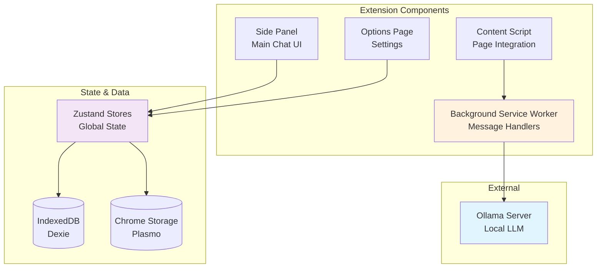
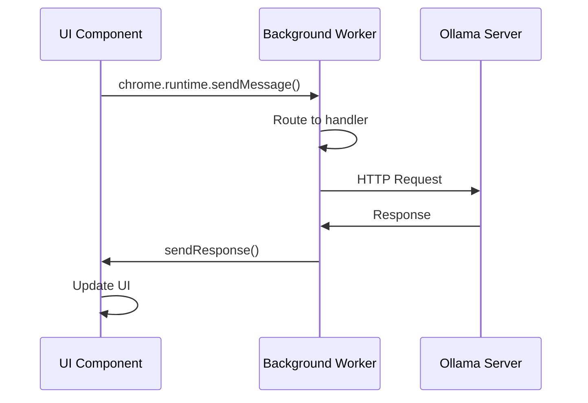
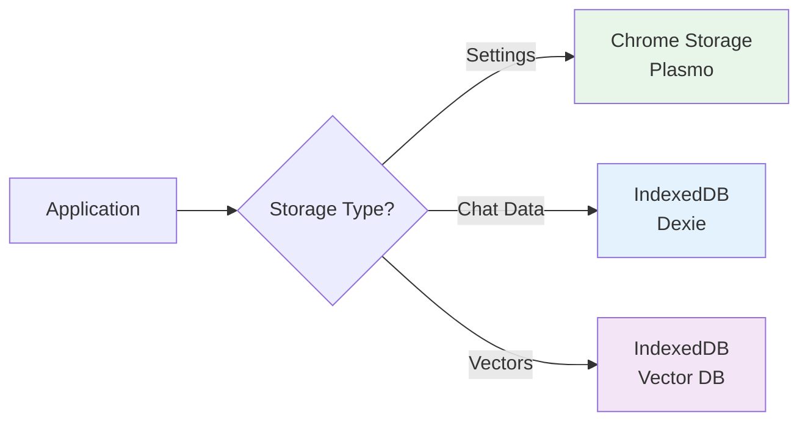
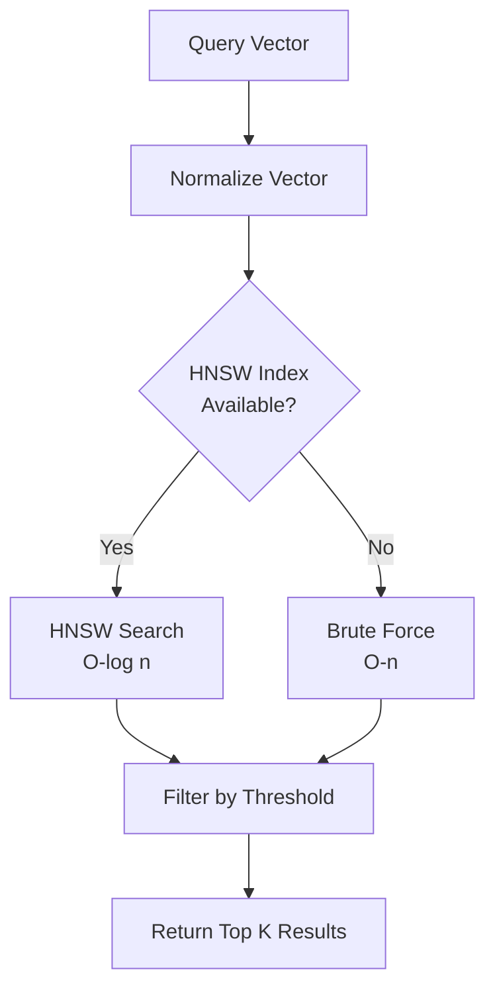

# Ollama Client - Architecture Documentation

> **Version**: 0.5.8  
> **Last Updated**: December 11, 2025

This document provides a comprehensive overview of the Ollama Client architecture, design patterns, and technical implementation details to help contributors understand the codebase.

---

## 📐 Architecture Overview

Ollama Client is a **privacy-first browser extension** built with modern web technologies. It follows a **feature-based modular architecture** with clear separation of concerns between UI, business logic, and data persistence.

### High-Level Architecture



---

## 🗂️ Project Structure

```
ollama-client/
├── src/
│   ├── background/          # Service worker & message handlers
│   │   ├── handlers/        # API request handlers
│   │   ├── lib/             # Background utilities
│   │   └── index.ts         # Service worker entry point
│   │
│   ├── sidepanel/           # Main chat interface
│   │   ├── components/      # Sidepanel-specific components
│   │   └── index.tsx        # Sidepanel entry point
│   │
│   ├── options/             # Settings page
│   │   ├── components/      # Settings UI components
│   │   └── index.tsx        # Options entry point
│   │
│   ├── contents/            # Content scripts
│   │   ├── selection-button.tsx  # Text selection button
│   │   └── index.ts         # Content script entry
│   │
│   ├── features/            # Feature modules (CORE)
│   │   ├── chat/            # Chat functionality
│   │   ├── file-upload/     # File processing
│   │   ├── knowledge/       # Knowledge management
│   │   ├── memory/          # Contextual memory
│   │   ├── model/           # Model management
│   │   ├── prompt/          # Prompt templates
│   │   ├── sessions/        # Session management
│   │   └── tabs/            # Browser tab integration
│   │
│   ├── lib/                 # Shared utilities
│   │   ├── embeddings/      # Vector search
│   │   ├── knowledge/       # RAG implementation
│   │   ├── text-processing/ # Text chunking
│   │   ├── file-processors/ # File format handlers
│   │   ├── loaders/         # Data loaders
│   │   ├── config/          # Configuration
│   │   ├── db.ts            # Database schema
│   │   ├── logger.ts        # Logging utility
│   │   └── utils.ts         # Helper functions
│   │
│   ├── components/          # Shared UI components
│   │   ├── ui/              # Shadcn UI components
│   │   └── settings/        # Settings components
│   │
│   ├── stores/              # Zustand state management
│   │   ├── search-dialog-store.ts
│   │   ├── shortcut-store.ts
│   │   ├── speech-store.ts
│   │   └── theme.ts
│   │
│   ├── hooks/               # Custom React hooks
│   ├── i18n/                # Internationalization
│   ├── locales/             # Translation files (9 languages)
│   ├── types/               # TypeScript definitions
│   └── test/                # Test setup & fixtures
│
├── tools/                   # Build & development tools
├── docs/                    # Documentation website
└── coverage/                # Test coverage reports
```

---

## 🧩 Feature Modules

Each feature module follows a consistent structure:

```
features/[feature-name]/
├── components/      # React components
├── hooks/           # Feature-specific hooks
├── stores/          # Zustand stores (if needed)
├── utils/           # Helper functions
└── __tests__/       # Unit tests
```

### Module Communication

Features communicate through:
1. **Zustand stores** - Global state sharing
2. **Chrome messages** - Background ↔ UI communication
3. **Custom events** - Component-to-component signaling
4. **React Context** - Scoped state (rarely used)

---

## 🔄 Message Passing Architecture

### Background ↔ UI Communication



### Message Types

Defined in `src/lib/constants.ts`:

```typescript
export const MESSAGE_KEYS = {
  OLLAMA: {
    GET_MODELS: "get-ollama-models",
    CHAT_WITH_MODEL: "chat-with-model",
    PULL_MODEL: "OLLAMA.PULL_MODEL",
    DELETE_MODEL: "delete-model",
    // ... more
  },
  BROWSER: {
    GET_PAGE_CONTENT: "get-page-content",
    ADD_SELECTION_TO_CHAT: "add-selection-to-chat"
  }
}
```

### Handler Pattern

```typescript
// src/background/handlers/handle-get-models.ts
export async function handleGetModels(sendResponse: SendResponseFunction) {
  try {
    const baseUrl = await getOllamaBaseUrl()
    const response = await fetch(`${baseUrl}/api/tags`)
    const data = await response.json()
    
    safeSendResponse(sendResponse, {
      success: true,
      data: data.models
    })
  } catch (error) {
    safeSendResponse(sendResponse, {
      success: false,
      error: { status: 0, message: error.message }
    })
  }
}
```

---

## 💾 Data Persistence

### Storage Layers



#### Chrome Storage (via Plasmo)

**Used for**: Settings, preferences, small data

```typescript
import { Storage } from "@/wab/plasmo/storage"

// Read
const theme = await storage.get(STORAGE_KEYS.THEME.PREFERENCE)

// Write
await storage.set(STORAGE_KEYS.THEME.PREFERENCE, "dark")
```

**Storage Keys** (see `src/lib/constants.ts`):
- `OLLAMA.*` - Ollama configuration
- `EMBEDDINGS.*` - Embedding settings
- `THEME.*` - UI theme
- `TTS.*` - Text-to-speech settings
- `LOGGER.*` - Logger configuration

#### IndexedDB (Dexie)

**Used for**: Chat sessions, messages, files

```typescript
// src/lib/db.ts
class ChatDatabase extends Dexie {
  sessions!: Table<ChatSession>
  
  constructor() {
    super("ChatDatabase")
    this.version(1).stores({
      sessions: "id, createdAt, updatedAt"
    })
  }
}

export const db = new ChatDatabase()
```

**Current Schema (v1)**:
- `sessions` - Chat sessions with embedded messages array

**Planned Schema (v2)** - See ROADMAP.md:
- `sessions` - Session metadata only
- `messages` - Individual messages with sessionId foreign key
- `files` - File attachments with sessionId foreign key

#### Vector Database

**Used for**: Embeddings for semantic search

```typescript
// src/lib/embeddings/vector-store.ts
class VectorDatabase extends Dexie {
  vectors!: Table<VectorDocument>
  
  constructor() {
    super("VectorDatabase")
    this.version(1).stores({
      vectors: "++id, metadata.type, metadata.sessionId, ..."
    })
  }
}
```

**Features**:
- HNSW indexing for fast similarity search
- Keyword index for hybrid search
- Pre-normalized vectors for performance
- Circular cache with configurable TTL

---

## 🎨 State Management

### Zustand Stores

**Philosophy**: Lightweight, no boilerplate, easy to test

```typescript
// src/stores/theme.ts
export const useThemeStore = create<ThemeState>((set) => ({
  theme: "system",
  setTheme: (theme) => set({ theme })
}))

// Usage in components
const { theme, setTheme } = useThemeStore()
```

### State Persistence

Stores automatically persist to Chrome Storage via Plasmo:

```typescript
const [theme, setTheme] = useStorage({
  key: STORAGE_KEYS.THEME.PREFERENCE,
  instance: plasmoGlobalStorage
}, "system")
```

### Store Files

- `theme.ts` - UI theme (dark/light/system)
- `search-dialog-store.ts` - Semantic search dialog state
- `shortcut-store.ts` - Keyboard shortcuts configuration
- `speech-store.ts` - Text-to-speech state
- `chat-session-store.ts` - Chat session state (feature-specific)
- `load-stream-store.ts` - Loading indicators

---

## 🔍 Vector Search Architecture

### HNSW Implementation

**Hierarchical Navigable Small World** graph for approximate nearest neighbor search.



**Performance**:
- **HNSW**: ~10-50ms for 10,000 vectors
- **Brute-force**: ~200-500ms for 10,000 vectors
- **Speedup**: 5-10x for large datasets

### Hybrid Search

Combines keyword and semantic search:

```typescript
// src/lib/embeddings/vector-store.ts
async function searchHybrid(
  query: string,
  { keywordWeight = 0.7, semanticWeight = 0.3 }
) {
  // 1. Keyword search (fast, exact)
  const keywordResults = await keywordIndexManager.search(query)
  
  // 2. Semantic search (slow, conceptual)
  const embedding = await generateEmbedding(query)
  const semanticResults = await searchSimilarVectors(embedding)
  
  // 3. Fuse results with weighted scoring
  return fuseResults(keywordResults, semanticResults, weights)
}
```

---

## 🧪 Testing Strategy

### Test Structure

```
src/
├── __tests__/           # Unit tests (co-located)
│   ├── *.test.ts
│   └── *.test.tsx
└── test/
    ├── setup.ts         # Global test setup
    └── fixtures/        # Test data
```

### Testing Tools

- **Vitest** - Test runner (faster than Jest)
- **Happy-DOM** - Lightweight DOM environment
- **Testing Library** - React component testing
- **Fake IndexedDB** - Mock IndexedDB for tests

### Coverage Configuration

```typescript
// vitest.config.ts
coverage: {
  include: ["src/**/*.ts"],
  exclude: [
    "src/**/*.{test,spec}.{ts,tsx}",
    "src/**/*.tsx",  // TODO: Add React component tests
    "src/**/types.ts",
    "src/**/*.d.ts"
  ]
}
```

**Current Coverage**: ~65% (TypeScript only)  
**Target Coverage**: 80%+ (including React components)

### Test Examples

```typescript
// Unit test example
describe("logger", () => {
  it("should filter logs by level", () => {
    logger.setLogLevel(LogLevel.WARN)
    logger.info("info message")
    logger.warn("warn message")
    
    const logs = logger.getLogs()
    expect(logs).toHaveLength(1)
    expect(logs[0].level).toBe(LogLevel.WARN)
  })
})

// Component test example (future)
describe("DeveloperSettings", () => {
  it("should export logs when button clicked", async () => {
    render(<DeveloperSettings />)
    
    const exportBtn = screen.getByText("Export Logs")
    await userEvent.click(exportBtn)
    
    // Assert download triggered
  })
})
```

---

## 🔐 Security & Privacy

### Privacy-First Design

1. **Local Processing**
   - All data stays on device
   - No cloud services
   - No analytics or tracking

2. **Secure Storage**
   - Chrome Storage API (encrypted by browser)
   - IndexedDB (local only)
   - No external databases

3. **CORS Handling**
   - Declarative Net Request (DNR) for Chromium
   - Manual OLLAMA_ORIGINS for Firefox
   - No eval() or remote code execution

### Content Security Policy

```json
// manifest.json (generated by Plasmo)
{
  "content_security_policy": {
    "extension_pages": "script-src 'self' 'wasm-unsafe-eval'; object-src 'self'"
  }
}
```

**Challenges**:
- OCR libraries require relaxed CSP
- WASM modules need `'wasm-unsafe-eval'`
- Worker scripts must be bundled

---

## 🎯 Design Patterns

### 1. Feature-Based Architecture

**Benefits**:
- Clear module boundaries
- Parallel development
- Easy to test in isolation
- Scalable team structure

**Example**: `features/chat/`
- Self-contained with components, hooks, stores
- Communicates via well-defined interfaces
- Can be extracted as standalone package

### 2. Composition over Inheritance

**React Components**:
```tsx
// Bad: Deep inheritance
class ChatMessage extends Message extends Component {}

// Good: Composition
function ChatMessage() {
  return (
    <MessageBubble>
      <MessageContent />
      <MessageActions />
    </MessageBubble>
  )
}
```

### 3. Custom Hooks for Logic Reuse

```typescript
// features/chat/hooks/use-chat.ts
export function useChat() {
  const [messages, setMessages] = useState([])
  const [isLoading, setIsLoading] = useState(false)
  
  const sendMessage = useCallback(async (content) => {
    // Logic here
  }, [])
  
  return { messages, isLoading, sendMessage }
}
```

### 4. Dependency Injection

```typescript
// testable code with DI
export class VectorStore {
  constructor(
    private db: Dexie,
    private embedder: EmbedderService
  ) {}
}

// In tests
const mockDb = createMockDb()
const mockEmbedder = createMockEmbedder()
const vectorStore = new VectorStore(mockDb, mockEmbedder)
```

---

## 📦 Build & Deployment

### Build Tool: Plasmo

Plasmo handles:
- Manifest generation (V3)
- TypeScript compilation
- Hot module replacement (HMR)
- Asset bundling
- Multi-browser support

```bash
# Development
pnpm dev          # Chrome (default)
pnpm dev:firefox  # Firefox

# Production
pnpm build        # Chrome
pnpm build:firefox
pnpm package      # Creates .zip for store submission
```

### Build Output

```
build/
├── chrome-mv3-prod/
│   ├── manifest.json
│   ├── background.js
│   ├── sidepanel.html
│   ├── options.html
│   └── assets/
└── firefox-mv3-prod/
    └── (similar structure)
```

---

## 🌍 Internationalization (i18n)

### Tech Stack

- **i18next** - Translation framework
- **react-i18next** - React bindings
- **i18next-browser-languagedetector** - Auto language detection

### Structure

```
src/locales/
├── en/translation.json    # English (base)
├── es/translation.json    # Spanish
├── fr/translation.json    # French
├── de/translation.json    # German
├── hi/translation.json    # Hindi
├── it/translation.json    # Italian
├── ja/translation.json    # Japanese
├── ru/translation.json    # Russian
└── zh/translation.json    # Chinese
```

### Usage

```tsx
import { useTranslation } from 'react-i18next'

function MyComponent() {
  const { t } = useTranslation()
  
  return (
    <div>
      <h1>{t('settings.title')}</h1>
      <p>{t('settings.description')}</p>
    </div>
  )
}
```

### Resource Generation

```bash
# tools/generate-i18n-resources.ts
# Bundles all translations into single resources.ts file
pnpm run generate-i18n
```

---

## 🚀 Performance Optimizations

### 1. Vector Search
- Pre-normalized embeddings (skip normalization)
- Float32Array for better memory locality
- HNSW indexing (5-10x faster)
- Search result caching (5min TTL)
- Early termination on low similarity

### 2. React Rendering
- `React.memo` for expensive components
- `useMemo` / `useCallback` to prevent re-renders
- Virtual scrolling (planned for v0.6.x)
- Code splitting with dynamic imports

### 3. Storage
- Circular log buffer (prevent memory bloat)
- Indexed queries only (no full table scans)
- Batch operations for embeddings
- Lazy loading of chat history

### 4. Network
- Streaming responses (no wait for completion)
- AbortController for cancellation
- Connection pooling via Ollama server
- Declarative Net Request (no overhead)

---

## 🔧 Development Tools

### Linting & Formatting

- **Biome** - Fast linter + formatter (replaces ESLint + Prettier)
- **Husky** - Git hooks
- **lint-staged** - Pre-commit checks

```bash
pnpm lint       # Check code
pnpm lint:fix   # Auto-fix issues
pnpm format     # Format code
```

### Testing

```bash
pnpm test            # Run tests
pnpm test:ui         # Visual test runner
pnpm test:coverage   # Generate coverage report
pnpm test:watch      # Watch mode
```

### Debugging

```bash
# Enable verbose logging
Settings → Developer → Log Level → Verbose

# Export logs
Settings → Developer → Export Logs

# View logs in real-time
Settings → Developer → View Logs
```

---

## 📚 Key Libraries

### Core
- `react` (18.2.0) - UI framework
- `typescript` (5.3.3) - Type safety
- `plasmo` (0.90.5) - Extension framework

### State & Data
- `zustand` (5.0.8) - State management
- `dexie` (4.0.11) - IndexedDB wrapper
- `@plasmohq/storage` (1.15.0) - Chrome Storage wrapper

### UI
- `@radix-ui/*` - Headless UI primitives
- `tailwindcss` (3.4.1) - Styling
- `lucide-react` (0.474.0) - Icons

### Content Processing
- `markdown-it` (14.1.0) - Markdown parsing
- `highlight.js` (11.11.1) - Code highlighting
- `pdfjs-dist` (4.0.379) - PDF processing
- `mammoth` (1.6.0) - DOCX processing
- `d3-dsv` (3.0.1) - CSV parsing
- `turndown` (7.2.2) - HTML → Markdown

### Vector Search
- `vectra` (0.11.1) - HNSW implementation
- `minisearch` (7.2.0) - Keyword search

### i18n
- `i18next` (25.6.3)
- `react-i18next` (16.3.5)
- `i18next-browser-languagedetector` (8.2.0)

---

## 🤝 Contributing Guidelines

### Code Style

1. **TypeScript First**
   - Use strict typing
   - Avoid `any` (use `unknown` if necessary)
   - Export types for reusability

2. **Component Structure**
   ```tsx
   // 1. Imports
   // 2. Types/Interfaces
   // 3. Component
   // 4. Styles (if any)
   // 5. Exports
   ```

3. **Naming Conventions**
   - Components: PascalCase (`ChatMessage`)
   - Files: kebab-case (`chat-message.tsx`)
   - Hooks: camelCase with `use` prefix (`useChat`)
   - Constants: SCREAMING_SNAKE_CASE (`STORAGE_KEYS`)

4. **File Organization**
   - Co-locate tests with source files
   - Group related components in directories
   - One component per file (exceptions for small helpers)

### Commit Messages

```
<type>(<scope>): <subject>

<body>

<footer>
```

**Types**: `feat`, `fix`, `docs`, `style`, `refactor`, `test`, `chore`

**Example**:
```
feat(logger): add structured logging system

- Created logger utility with configurable levels
- Added developer settings UI
- Implemented log export functionality

Closes #123
```

### Pull Request Process

1. Create feature branch from `main`
2. Implement changes with tests
3. Run `pnpm lint` and `pnpm test`
4. Update documentation if needed
5. Submit PR with clear description
6. Address review comments
7. Squash and merge

---

## 📖 Additional Resources

- [README.md](./README.md) - Project overview
- [ROADMAP.md](./ROADMAP.md) - Future plans
- [CONTRIBUTING.md](./CONTRIBUTING.md) - How to contribute
- [PROJECT_ANALYSIS.md](./PROJECT_ANALYSIS.md) - Code quality analysis

---

**Questions?** Open an issue or reach out on [GitHub](https://github.com/Shishir435/ollama-client/issues).
