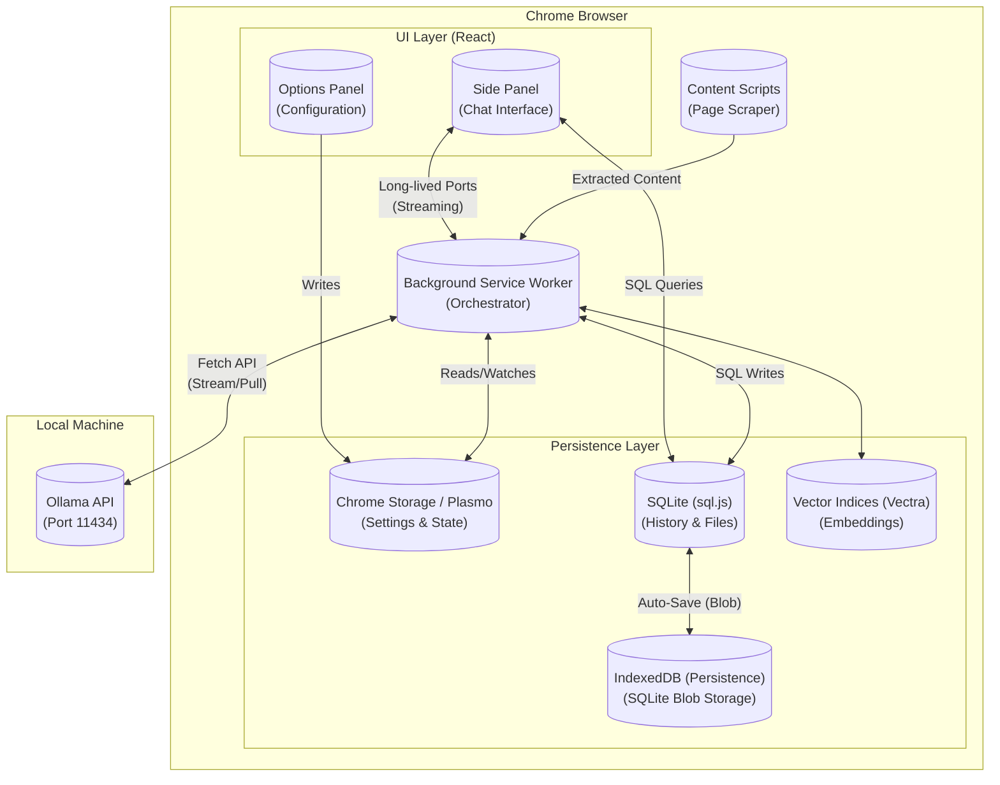
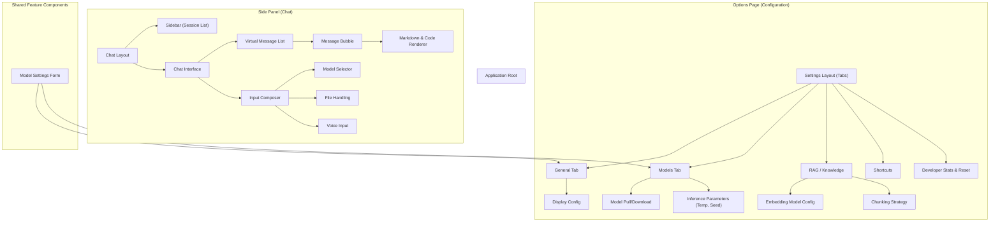
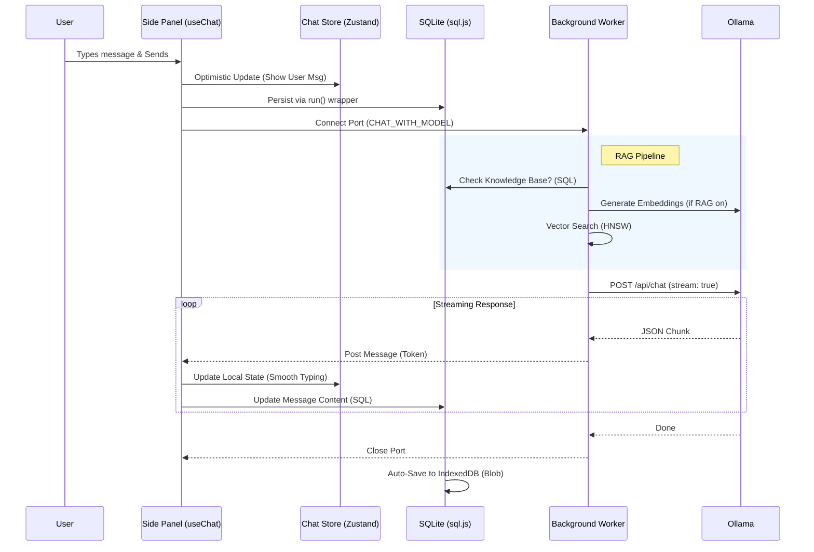
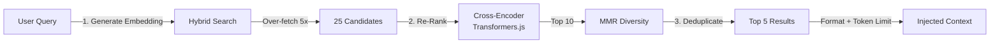

# Architecture Documentation

## 1. System Overview

The **Ollama Client** is a privacy-first Chrome Extension designed to interact directly with a local Ollama instance. It leverages a **Browser-Centric Architecture**, essentially operating as a "Thick Client" within the browser. The system eliminates the need for an intermediate backend server, communicating directly from the extension to the local Ollama API.

The architecture is composed of three primary execution contexts:

1.  **Side Panel (Main UI)**: The primary interface for chat, residing in the browser's side panel. It manages session state, message rendering, and user input.
2.  **Options Configuration (Settings)**: A dedicated page for deep configuration (Models, RAG, Knowledge Base, Shortcuts). It interacts heavily with the global storage to persist user preferences.
3.  **Background Service Worker**: The "Brain" of the extension. It handles long-running tasks (model pulling, embedding generation), manages the persistent connection to Ollama, and coordinates between the Side Panel and Content Scripts.

```mermaid
graph TD
    subgraph Browser["Chrome Browser"]
        subgraph UI_Layer["UI Layer (React)"]
            SidePanel[("Side Panel
            (Chat Interface)")]
            OptionsUI[("Options Panel
            (Configuration)")]
        end
        
        BG[("Background Service Worker
        (Orchestrator)")]
        
        CS[("Content Scripts
        (Page Scraper)")]
        
        subgraph Persistence["Persistence Layer"]
            Storage[("Chrome Storage / Plasmo
            (Settings & State)")]
            SQLite[("SQLite (sql.js)
            (History & Files)")]
            VectorDB[("Vector Indices (Vectra)
            (Embeddings)")]
            IndexedDB[("IndexedDB (Persistence)
            (SQLite Blob Storage)")]
        end
    end

    subgraph LocalHost["Local Machine"]
        Ollama[("Ollama API
        (Port 11434)")]
    end

    %% Communications
    SidePanel <-->|"Long-lived Ports
    (Streaming)"| BG
    OptionsUI -->|"Writes"| Storage
    BG <-->|"Reads/Watches"| Storage
    
    BG <-->|"Fetch API
    (Stream/Pull)"| Ollama
    
    SidePanel <-->|"SQL Queries"| SQLite
    BG <-->|"SQL Writes"| SQLite
    SQLite <-->|"Auto-Save (Blob)"| IndexedDB
    
    BG <--> VectorDB
    CS -->|"Extracted Content"| BG
```

---

## 2. Component Hierarchy

The application follows a **Domain-Driven Design (DDD)** approach where features are encapsulated in `src/features/`. The UI is split between the **Side Panel** (Chat focus) and **Options Page** (Management focus).

```mermaid
graph TD
    Root["Application Root"]
    
    subgraph SidePanel["Side Panel (Chat)"]
        ChatLayout["Chat Layout"]
        ChatLayout --> Sidebar["Sidebar (Session List)"]
        ChatLayout --> ChatArea["Chat Interface"]
        
        ChatArea --> MessageList["Virtual Message List"]
        MessageList --> MessageItem["Message Bubble"]
        MessageItem --> Markdown["Markdown & Code Renderer"]
        
        ChatArea --> InputArea["Input Composer"]
        InputArea --> ModelSelect["Model Selector"]
        InputArea --> FileUpload["File Handling"]
        InputArea --> Dictation["Voice Input"]
    end
    
    subgraph OptionsPage["Options Page (Configuration)"]
        OptionsLayout["Settings Layout (Tabs)"]
        
        OptionsLayout --> GenTab["General Tab"]
        GenTab --> DisplaySettings["Display Config"]
        
        OptionsLayout --> ModelTab["Models Tab"]
        ModelTab --> PullPanel["Model Pull/Download"]
        ModelTab --> ParamSettings["Inference Parameters (Temp, Seed)"]
        
        OptionsLayout --> RAGTab["RAG / Knowledge"]
        RAGTab --> EmbedConfig["Embedding Model Config"]
        RAGTab --> ChunkConfig["Chunking Strategy"]
        
        OptionsLayout --> ShortcutTab["Shortcuts"]
        OptionsLayout --> DeveloperTab["Developer Stats & Reset"]
    end
    
    subgraph Shared["Shared Feature Components"]
        ModelSettings["Model Settings Form"] --> GenTab
        ModelSettings --> ModelTab
    end
```

---

## 3. Data Flow

### 3.1. Chat Interaction (Streaming)
The chat flow involves a complex coordination between the UI (for responsiveness) and the Background/DB (for persistence).

```mermaid
sequenceDiagram
    participant User
    participant UI as Side Panel (useChat)
    participant Store as Chat Store (Zustand)
    participant DB as SQLite (sql.js)
    participant BG as Background Worker
    participant Ollama

    User->>UI: Types message & Sends
    UI->>Store: Optimistic Update (Show User Msg)
    UI->>DB: Persist via run() wrapper
    UI->>BG: Connect Port (CHAT_WITH_MODEL)
    
    rect rgb(240, 248, 255)
    note right of BG: RAG Pipeline
    BG->>DB: Check Knowledge Base? (SQL)
    BG->>Ollama: Generate Embeddings (if RAG on)
    BG->>BG: Vector Search (HNSW)
    end
    
    BG->>Ollama: POST /api/chat (stream: true)
    
    loop Streaming Response
        Ollama-->>BG: JSON Chunk
        BG-->>UI: Post Message (Token)
        UI->>Store: Update Local State (Smooth Typing)
        UI->>DB: Update Message Content (SQL)
    end
    
    Ollama-->>BG: Done
    BG-->>UI: Close Port
    DB->>DB: Auto-Save to IndexedDB (Blob)
```

### 3.2. Configuration Propagation
Settings changes in the Options page are reactive.

1.  **User Change**: User selects a new "Embedding Model" in Options.
2.  **Storage Update**: `useStorage` hook updates `plasmo-global-storage`.
3.  **Background Reaction**: Background worker (listening to storage changes) detects the change.
4.  **Action**: If the model isn't downloaded, Background initiates a silent pull of the new embedding model.
5.  **State Sync**: UI sees the status change via the shared storage hook.

---

## 4. Core Features Breakdown

### 4.1. Model Management (The "Ollama Manager")
The extension acts as a full GUI for Ollama operations.
-   **Discovery**: Queries `localhost:11434/api/tags` to list local models.
-   **Library**: `src/features/model` contains components for pulling, deleting, and detailed inspection of models.
-   **Pulling Mechanism**: Implemented in `handleTheModelPull` using `fetch` streams. It supports resuming and cancellation via `AbortController`.

### 4.2. Enhanced RAG System (3-Stage Pipeline)
A robust RAG pipeline running entirely in-browser, designed to maximize precision while minimizing noise.

#### Architecture Overview
The system implements a **Multi-Stage Retrieval Pipeline** to balance recall (finding all relevant docs) with precision (filtering noise):

```mermaid
graph LR
    Query[User Query] -->|1. Generate Embedding| Hybrid[Hybrid Search]
    Hybrid -->|Over-fetch 5x| Candidates[25 Candidates]
    Candidates -->|2. Re-Rank| Reranker[Cross-Encoder
    Transformers.js]
    Reranker -->|Top 10| MMR[MMR Diversity]
    MMR -->|3. Deduplicate| Final[Top 5 Results]
    Final -->|Format + Token Limit| Context[Injected Context]
```

#### Stage 1: Hybrid Search (Recall-Optimized)
Combines **BM25 Keyword Search** (60% weight) with **Vector Semantic Search** (40% weight).

**Why Hybrid?**
- Pure vector search fails on exact term matches (e.g., "What is useState?" might miss docs with that exact hook name)
- Pure keyword search fails on semantic variations (e.g., "How to manage state" wouldn't match "useState documentation")

**Implementation:**
- Uses **Vectra** for HNSW vector indexing
- Uses **MiniSearch** for BM25 keyword scoring
- Over-fetches 5x the requested results (e.g., retrieve 25 candidates for topK=5)

#### Stage 2: Cross-Encoder Re-Ranking (Precision-Optimized)
Uses `transformers.js` with **WebGPU acceleration** to run a cross-encoder model (`ms-marco-MiniLM-L-6-v2`).

**Why Re-Ranking?**
Bi-encoders (used in Stage 1) encode query and document separately, missing subtle relevance signals. Cross-encoders score query-document pairs jointly, dramatically improving precision.

**Performance:**
- WebGPU: ~50ms for 25 documents
- CPU Fallback: ~200ms for 25 documents

#### Stage 3: MMR Diversity Filtering
Applies **Maximal Marginal Relevance** to ensure the final context set covers diverse aspects of the query.

**Formula:** `MMR = λ · relevance - (1-λ) · max_similarity_to_selected`

**Configuration:**
- `λ = 0.7` (default): Balanced
- `λ = 0.9`: Strict relevance (allows duplicates)
- `λ = 0.5`: Maximum diversity

#### Noise Reduction Features

##### 1. Content Quality Filtering
**Applied:** At ingestion time (before embedding)

Heuristic scoring system that evaluates:
- **Positive Signals:** Code blocks (+0.25), Technical terms (+0.15), Complete thoughts (+0.12)
- **Negative Signals:** Greetings (-0.5), Very short (-0.2), Simple affirmations (-0.4)

**Threshold:** 0.4 (default) - Content scoring below this is not embedded

##### 2. Markdown-Aware Chunking
**Strategy:** Respects document structure
- Splits by headers (H1-H6) to keep sections together
- Preserves code blocks intact
- Falls back to hybrid chunking for oversized sections

**Benefit:** Avoids mid-sentence or mid-code splits that destroya semantic context

#### Token Limit Enforcement
All context is truncated to respect the model's context window:
- Default: 1000 tokens (~4000 characters)
- Estimation: `tokens ≈ characters / 4`

#### Configuration UI
Users can tune the pipeline under **Settings > Models > Advanced Retrieval**:
- Re-Ranking Toggle
- Hybrid Search Toggle
- Keyword/Semantic Weight Balance
- MMR Diversity Lambda
- Quality Filter Strictness

#### Known Limitations
- **Language Bias:** Quality filter optimized for English technical content
- **No Temporal Weighting:** Recent docs not prioritized over old ones
- **Code-Heavy Edge Case:** Re-ranker may struggle with pure code without surrounding text
- **Fixed Weights:** Keyword/semantic balance not adaptive to query type

### 4.3. Persistence Strategy
-   **SQLite (sql.js)**: Primary relational storage.
    -   `sessions`: Normalized session metadata.
    -   `messages`: Tree-based message storage (supports branching).
    -   `files`: Binary data for attachments.
-   **IndexedDB (Persistence)**: Used strictly as a blob store for the SQLite database file to ensure persistence across browser restarts.
-   **Chrome Storage**: Configuration and lightweight state (active tab, theme).

---

## 5. Security & Privacy

### "Zero-Cloud" Guarantee
The pivotal design choice of this application is **Local-Only Execution**.
-   **No Analytics**: The source code contains no analytics SDKs (Google Analytics, Mixpanel, etc.).
-   **Direct LAN Access**: Interaction is strictly `Browser <-> Localhost`.
-   **DOM Access**: `host_permissions` are used strictly for the "Read Page" feature, initiated by user action.

### Content Security Policy (CSP)
The extension relies on the relaxation of CSP for `localhost` connections to allow communication with the Ollama API, which is standard for local AI tools.
