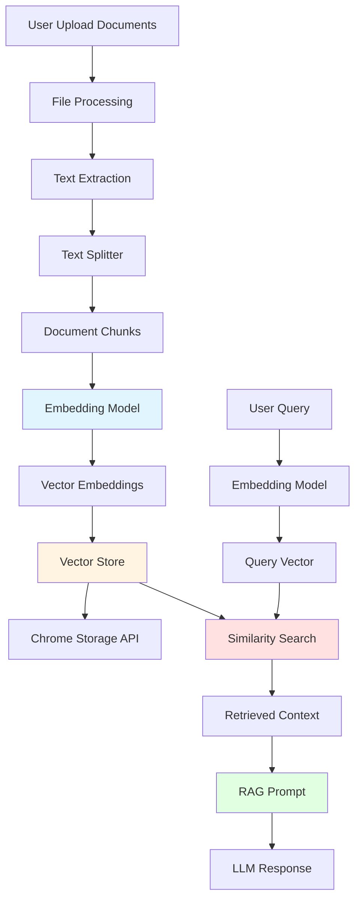
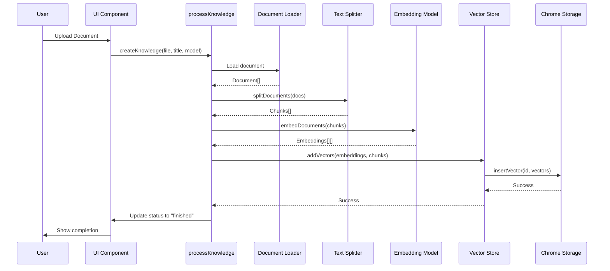
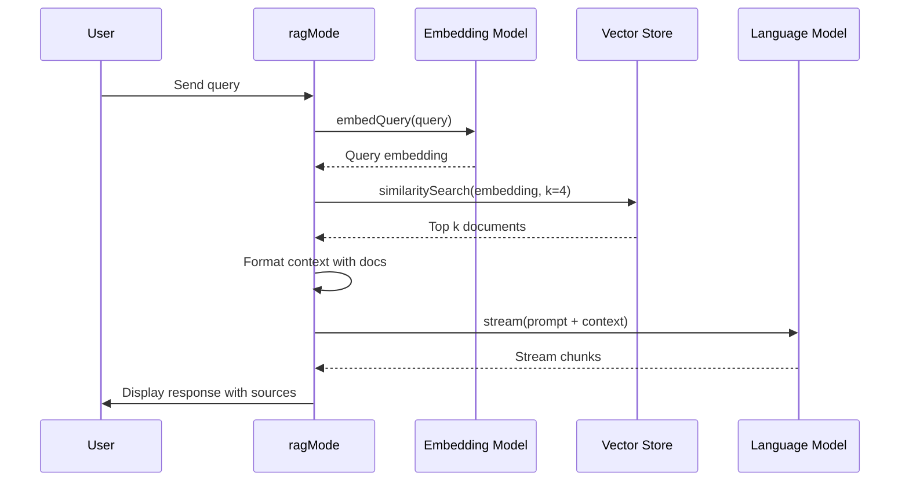
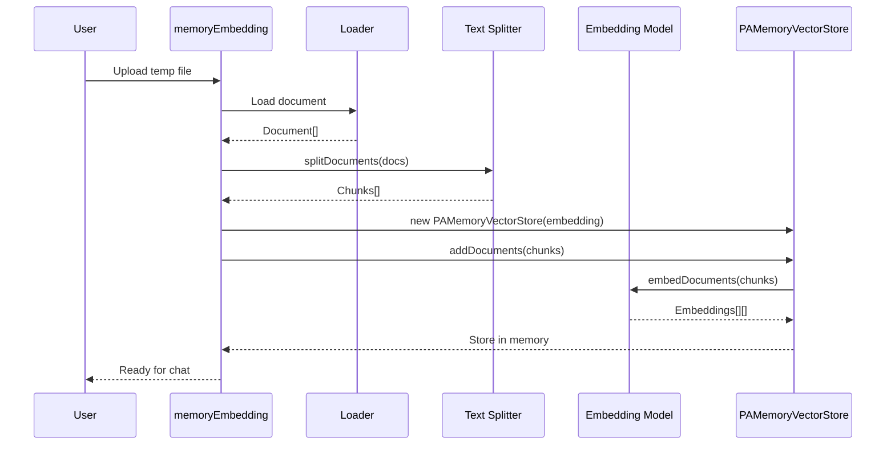

# Knowledge/Memory System Architecture Documentation

## Table of Contents
1. [Overview](#overview)
2. [Core Architecture](#core-architecture)
3. [Embedding Models](#embedding-models)
4. [Vector Stores](#vector-stores)
5. [Text Chunking & Processing](#text-chunking--processing)
6. [RAG (Retrieval-Augmented Generation) Implementation](#rag-retrieval-augmented-generation-implementation)
7. [Storage Layer](#storage-layer)
8. [Data Flow](#data-flow)
9. [API Reference](#api-reference)
10. [Implementation Guide](#implementation-guide)

---

## Overview

PageAssist implements a comprehensive knowledge/memory system that enables AI chat with document understanding through:
- **Vector embeddings** for semantic search
- **Multiple embedding model support** (Ollama local models, OpenAI-compatible APIs)
- **Persistent vector storage** using Chrome Storage API
- **RAG (Retrieval-Augmented Generation)** for context-aware responses
- **Document processing** with support for PDF, DOCX, CSV, TXT, and HTML

### Key Features
- **Dual Vector Store Architecture**: Persistent storage and in-memory storage
- **Flexible Embedding Models**: Support for local (Ollama) and remote (OpenAI-compatible) models
- **Advanced Text Chunking**: RecursiveCharacterTextSplitter and CharacterTextSplitter
- **Cosine Similarity Search**: Using ml-distance library
- **Chrome Extension Storage**: Leveraging chrome.storage.local for persistence

---

## Core Architecture

### Technology Stack

```typescript
// Core Dependencies
import { VectorStore } from "@langchain/core/vectorstores"
import { Embeddings } from "@langchain/core/embeddings"
import { RecursiveCharacterTextSplitter, CharacterTextSplitter } from "langchain/text_splitter"
import { similarity as ml_distance_similarity } from "ml-distance"
import { Document } from "@langchain/core/documents"
```

### Architecture Diagram



---

## Embedding Models

PageAssist supports two types of embedding models:

### 1. OllamaEmbedding (Local Models)

For running local embedding models via Ollama.

**File**: `src/models/OllamaEmbedding.ts`

```typescript
export class OllamaEmbeddingsPageAssist extends Embeddings {
  model = "llama2"  // Default model
  baseUrl = "http://localhost:11434"  // Default Ollama URL
  headers?: Record<string, string>
  keepAlive?: string
  requestOptions?: OllamaRequestParams["options"]
  signal?: AbortSignal

  constructor(params?: OllamaEmbeddingsParams) {
    super({ maxConcurrency: 1, ...params })
    // Initialize parameters
    if (params?.model) this.model = params.model
    if (params?.baseUrl) this.baseUrl = params.baseUrl
    if (params?.headers) this.headers = params.headers
    if (params?.keepAlive) this.keepAlive = parseKeepAlive(params.keepAlive)
    if (params?.requestOptions) {
      this.requestOptions = this._convertOptions(params.requestOptions)
    }
    if (params?.signal) this.signal = params.signal
  }

  // Core method to generate embeddings for a single text
  async embedQuery(document: string): Promise<number[]> {
    return (await this.embedDocuments([document]))[0]
  }

  // Core method to generate embeddings for multiple documents
  async embedDocuments(documents: string[]): Promise<number[][]> {
    return this._embed(documents)
  }

  // Internal method that handles API requests
  private async _request(prompt: string): Promise<number[]> {
    const { model, baseUrl, keepAlive, requestOptions } = this
    
    const response = await fetch(`${baseUrl}/api/embed`, {
      method: "POST",
      headers: {
        "Content-Type": "application/json",
        ...this.headers
      },
      body: JSON.stringify({
        input: prompt,
        model,
        keep_alive: keepAlive,
        options: requestOptions
      }),
      signal: this.signal
    })

    if (!response.ok) {
      throw new Error(`Request to Ollama server failed: ${response.status}`)
    }

    const json = await response.json()
    return json?.embeddings  // Returns number[] embedding vector
  }
}
```

**Key Features**:
- Uses Ollama API (`/api/embed` endpoint)
- Supports custom headers and request options
- Converts camelCase options to snake_case for API compatibility
- Handles keep-alive for persistent connections
- **Default embedding dimension**: Model-dependent (e.g., nomic-embed-text: 768 dimensions)

### 2. OAIEmbedding (OpenAI-Compatible APIs)

For OpenAI and compatible embedding APIs.

**File**: `src/models/OAIEmbedding.ts`

```typescript
export class OAIEmbedding extends Embeddings {
  modelName = "text-embedding-ada-002"
  model = "text-embedding-ada-002"
  batchSize = 512  // Process documents in batches
  stripNewLines = true  // Preprocess text
  dimensions?: number  // For text-embedding-3 and later
  timeout?: number
  protected client: OpenAIClient
  signal?: AbortSignal

  constructor(fields?: Partial<OpenAIEmbeddingsParams>) {
    const fieldsWithDefaults = { maxConcurrency: 2, ...fields }
    super(fieldsWithDefaults)

    this.modelName = fieldsWithDefaults?.model ?? this.model
    this.batchSize = fieldsWithDefaults?.batchSize || this.batchSize
    this.dimensions = fieldsWithDefaults?.dimensions

    // Initialize OpenAI client
    this.client = new OpenAIClient({
      apiKey: fields?.apiKey,
      baseURL: fields?.configuration?.basePath,
      dangerouslyAllowBrowser: true,
      ...fields?.configuration
    })
  }

  async embedDocuments(texts: string[]): Promise<number[][]> {
    // Process in batches to handle large document sets
    const batches = chunkArray(
      this.stripNewLines ? texts.map((t) => t.replace(/\n/g, " ")) : texts,
      this.batchSize
    )

    const batchRequests = batches.map((batch) => {
      const params: OpenAIClient.EmbeddingCreateParams = {
        model: this.model,
        input: batch
      }
      if (this.dimensions) {
        params.dimensions = this.dimensions
      }
      return this.embeddingWithRetry(params)
    })

    const batchResponses = await Promise.all(batchRequests)

    const embeddings: number[][] = []
    for (let i = 0; i < batchResponses.length; i++) {
      const { data: batchResponse } = batchResponses[i]
      for (let j = 0; j < batches[i].length; j++) {
        embeddings.push(batchResponse[j].embedding)
      }
    }
    return embeddings
  }

  async embedQuery(text: string): Promise<number[]> {
    const params: OpenAIClient.EmbeddingCreateParams = {
      model: this.model,
      input: this.stripNewLines ? text.replace(/\n/g, " ") : text
    }
    if (this.dimensions) {
      params.dimensions = this.dimensions
    }
    const { data } = await this.embeddingWithRetry(params)
    return data[0].embedding
  }
}
```

**Key Features**:
- Batch processing (default 512 documents per batch)
- Configurable embedding dimensions (for text-embedding-3+)
- Automatic newline stripping
- Retry mechanism with error handling
- **Default embedding dimension**: 1536 for ada-002, configurable for newer models

### 3. Unified Embedding Factory

**File**: `src/models/embedding.ts`

```typescript
type EmbeddingModel = {
  model: string
  baseUrl: string
  signal?: AbortSignal
  keepAlive?: string
}

export const pageAssistEmbeddingModel = async ({
  baseUrl,
  model,
  keepAlive,
  signal
}: EmbeddingModel) => {
  const isCustom = isCustomModel(model)
  
  if (isCustom) {
    // For custom OpenAI-compatible models
    const modelInfo = await getModelInfo(model)
    const providerInfo = await getOpenAIConfigById(modelInfo.provider_id)
    
    return new OAIEmbedding({
      modelName: modelInfo.model_id,
      model: modelInfo.model_id,
      signal,
      openAIApiKey: providerInfo.apiKey || "temp",
      configuration: {
        apiKey: providerInfo.apiKey || "temp",
        baseURL: providerInfo.baseUrl || "",
      }
    })
  }

  // For Ollama models
  return new OllamaEmbeddingsPageAssist({
    model,
    baseUrl,
    keepAlive,
    signal
  })
}
```

---

## Vector Stores

PageAssist implements two vector store classes:

### 1. PageAssistVectorStore (Persistent Storage)

**File**: `src/libs/PageAssistVectorStore.ts`

This is the main vector store that persists data to Chrome Storage.

```typescript
interface PageAssistVector {
  content: string
  embedding: number[]
  metadata: Record<string, any>
}

export interface MemoryVectorStoreArgs {
  knownledge_id: string  // Knowledge base ID
  file_id?: string       // Optional file ID
  similarity?: typeof ml_distance_similarity.cosine
}

export class PageAssistVectorStore extends VectorStore {
  declare FilterType: (doc: Document) => boolean
  
  knownledge_id: string
  file_id?: string
  memoryVectors: PageAssistVector[] = []  // In-memory cache for temp files
  similarity: typeof ml_distance_similarity.cosine

  constructor(embeddings: EmbeddingsInterface, args: MemoryVectorStoreArgs) {
    super(embeddings, args)
    this.similarity = args?.similarity ?? ml_distance_similarity.cosine
    this.knownledge_id = args?.knownledge_id
    this.file_id = args?.file_id
  }

  // Add documents to the store
  async addDocuments(documents: Document[]): Promise<void> {
    const texts = documents.map(({ pageContent }) => pageContent)
    return this.addVectors(
      await this.embeddings.embedDocuments(texts),
      documents
    )
  }

  // Add pre-computed vectors
  async addVectors(vectors: number[][], documents: Document[]): Promise<void> {
    const memoryVectors = vectors.map((embedding, idx) => ({
      content: documents[idx].pageContent,
      embedding,
      metadata: documents[idx].metadata,
      file_id: this.file_id
    }))

    // Store in memory for temp files, otherwise persist to Chrome Storage
    if (this.file_id === "temp_uploaded_files") {
      this.memoryVectors.push(...memoryVectors)
    } else {
      await insertVector(`vector:${this.knownledge_id}`, memoryVectors)
    }
  }

  // Similarity search
  async similaritySearchVectorWithScore(
    query: number[],
    k: number,
    filter?: this["FilterType"]
  ): Promise<[Document, number][]> {
    // Get vectors from storage or memory
    let pgVector: PageAssistVector[]
    if (this.file_id === "temp_uploaded_files") {
      pgVector = [...this.memoryVectors]
    } else {
      const data = await getVector(`vector:${this.knownledge_id}`)
      pgVector = [...data.vectors]
    }

    // Apply filter if provided
    const filterFunction = (memoryVector: PageAssistVector) => {
      if (!filter) return true
      const doc = new Document({
        metadata: memoryVector.metadata,
        pageContent: memoryVector.content
      })
      return filter(doc)
    }

    const filteredMemoryVectors = pgVector.filter(filterFunction)
    
    // Calculate similarity scores using cosine similarity
    const searches = filteredMemoryVectors
      .map((vector, index) => ({
        similarity: this.similarity(query, vector.embedding),
        index
      }))
      .sort((a, b) => (a.similarity > b.similarity ? -1 : 0))
      .slice(0, k)

    // Return top k results with scores
    return searches.map((search) => [
      new Document({
        metadata: filteredMemoryVectors[search.index].metadata,
        pageContent: filteredMemoryVectors[search.index].content
      }),
      search.similarity
    ])
  }

  // Get all page content (for context window filling)
  async getAllPageContent() {
    let pgVector: PageAssistVector[]
    if (this.file_id === "temp_uploaded_files") {
      pgVector = [...this.memoryVectors]
    } else {
      const data = await getVector(`vector:${this.knownledge_id}`)
      pgVector = [...data.vectors]
    }

    const maxContext = await getMaxContextSize()
    
    let contextLength = 0
    const pageContent: string[] = []
    const metadata: Record<string, any>[] = []

    // Fill context up to max size
    for (let i = 0; i < pgVector.length; i++) {
      contextLength += pgVector[i].content.length
      if (contextLength > maxContext) break
      
      pageContent.push(pgVector[i].content)
      metadata.push({
        ...pgVector[i].metadata,
        pageContent: pgVector[i].content
      })
    }

    return {
      pageContent: pageContent.join("\n\n"),
      metadata
    }
  }

  // Factory methods
  static async fromDocuments(
    docs: Document[],
    embeddings: EmbeddingsInterface,
    dbConfig?: MemoryVectorStoreArgs
  ): Promise<PageAssistVectorStore> {
    const instance = new this(embeddings, dbConfig)
    await instance.addDocuments(docs)
    return instance
  }

  static async fromExistingIndex(
    embeddings: EmbeddingsInterface,
    dbConfig?: MemoryVectorStoreArgs
  ): Promise<PageAssistVectorStore> {
    return new this(embeddings, dbConfig)
  }
}
```

**Key Features**:
- **Cosine Similarity**: Uses `ml-distance` library for similarity calculations
- **Hybrid Storage**: In-memory for temp files, Chrome Storage for persistent data
- **Configurable K**: Return top k most similar documents
- **Metadata Support**: Store and retrieve document metadata
- **Context Window Management**: getAllPageContent() respects max context size

### 2. PAMemoryVectorStore (In-Memory Only)

**File**: `src/libs/PAMemoryVectorStore.ts`

A simpler in-memory vector store for temporary document processing.

```typescript
interface MemoryVector {
  content: string
  embedding: number[]
  metadata: Record<string, any>
}

export class PAMemoryVectorStore extends VectorStore {
  declare FilterType: (doc: Document) => boolean
  
  private memoryVectors: MemoryVector[] = []
  private similarity: typeof ml_distance_similarity.cosine

  constructor(embeddings: EmbeddingsInterface, args?: MemoryVectorStoreArgs) {
    super(embeddings, args)
    this.similarity = args?.similarity ?? ml_distance_similarity.cosine
  }

  async addDocuments(documents: Document[]): Promise<void> {
    const texts = documents.map((doc) => doc.pageContent)
    const embeddings = await this.embeddings.embedDocuments(texts)
    await this.addVectors(embeddings, documents)
  }

  async addVectors(vectors: number[][], documents: DocumentInterface[]): Promise<void> {
    const memoryVectors = documents.map((doc, index) => ({
      content: doc.pageContent,
      embedding: vectors[index],
      metadata: doc.metadata
    }))
    this.memoryVectors.push(...memoryVectors)
  }

  async similaritySearch(query: string, k = 4): Promise<Document[]> {
    const queryEmbedding = await this.embeddings.embedQuery(query)
    
    const similarities = this.memoryVectors.map((vector) => ({
      similarity: this.similarity(queryEmbedding, vector.embedding),
      document: vector
    }))

    similarities.sort((a, b) => b.similarity - a.similarity)
    const topK = similarities.slice(0, k)

    return topK.map(({ document }) =>
      new Document({
        pageContent: document.content,
        metadata: document.metadata
      })
    )
  }

  async similaritySearchWithScore(query: string, k = 4): Promise<[Document, number][]> {
    const queryEmbedding = await this.embeddings.embedQuery(query)
    
    const similarities = this.memoryVectors.map((vector) => ({
      similarity: this.similarity(queryEmbedding, vector.embedding),
      document: vector
    }))

    similarities.sort((a, b) => b.similarity - a.similarity)
    const topK = similarities.slice(0, k)

    return topK.map(({ document, similarity }) => [
      new Document({
        pageContent: document.content,
        metadata: document.metadata
      }),
      similarity
    ])
  }

  static async fromDocuments(
    docs: Document[],
    embeddings: EmbeddingsInterface,
    args?: MemoryVectorStoreArgs
  ): Promise<PAMemoryVectorStore> {
    const store = new PAMemoryVectorStore(embeddings, args)
    await store.addDocuments(docs)
    return store
  }
}
```

**Use Cases**:
- Temporary document chat sessions
- Quick embedding generation without persistence
- Testing and development

---

## Text Chunking & Processing

### Text Splitter Configuration

**File**: `src/utils/text-splitter.ts`

```typescript
export const getPageAssistTextSplitter = async () => {
  const chunkSize = await defaultEmbeddingChunkSize()      // Default: 1000
  const chunkOverlap = await defaultEmbeddingChunkOverlap() // Default: 200
  const splittingStrategy = await defaultSplittingStrategy() // Default: RecursiveCharacterTextSplitter

  switch (splittingStrategy) {
    case "CharacterTextSplitter":
      const splittingSeparator = await defaultSsplttingSeparator() // Default: \n\n
      const processedSeparator = splittingSeparator
        .replace(/\\n/g, "\n")
        .replace(/\\t/g, "\t")
        .replace(/\\r/g, "\r")
      
      return new CharacterTextSplitter({
        chunkSize,
        chunkOverlap,
        separator: processedSeparator
      })
    
    default:
      return new RecursiveCharacterTextSplitter({
        chunkSize,
        chunkOverlap
      })
  }
}
```

**Configuration Options**:

| Parameter | Default | Description |
|-----------|---------|-------------|
| `chunkSize` | 1000 | Maximum characters per chunk |
| `chunkOverlap` | 200 | Overlap between consecutive chunks |
| `splittingStrategy` | `RecursiveCharacterTextSplitter` | Splitting algorithm |
| `separator` | `\n\n` | For CharacterTextSplitter only |

**Splitting Strategies**:

1. **RecursiveCharacterTextSplitter** (Recommended)
   - Tries to split on paragraph breaks first
   - Falls back to sentences, then words, then characters
   - Preserves semantic coherence

2. **CharacterTextSplitter**
   - Splits on a specific separator
   - More predictable but less semantic
   - Good for structured documents

### Document Processing Pipeline

**File**: `src/libs/process-knowledge.ts`

```typescript
export const processKnowledge = async (msg: any, id: string): Promise<void> => {
  const knowledge = await getKnowledgeById(id)
  const ollamaUrl = await getOllamaURL()

  await updateKnowledgeStatus(id, "processing")

  // Initialize embedding model
  const ollamaEmbedding = await pageAssistEmbeddingModel({
    baseUrl: cleanUrl(ollamaUrl),
    model: knowledge.embedding_model
  })

  const textSplitter = await getPageAssistTextSplitter()

  // Process each document source
  for (const doc of knowledge.source) {
    if (!doc?.content || doc?.content === null) {
      continue
    }

    let loader
    let docs

    // Select appropriate loader based on file type
    if (doc.type === "pdf" || doc.type === "application/pdf") {
      loader = new PageAssistPDFUrlLoader({
        name: doc.filename,
        url: doc.content
      })
    } else if (doc.type === "csv" || doc.type === "text/csv") {
      loader = new PageAssisCSVUrlLoader({
        name: doc.filename,
        url: doc.content,
        options: {}
      })
    } else if (doc.type === "docx" || doc.type === "application/vnd.openxmlformats-officedocument.wordprocessingml.document") {
      loader = new PageAssistDocxLoader({
        fileName: doc.filename,
        buffer: await toArrayBufferFromBase64(doc.content)
      })
    } else {
      loader = new PageAssisTXTUrlLoader({
        name: doc.filename,
        url: doc.content
      })
    }

    // Load and split documents
    docs = await loader.load()
    const chunks = await textSplitter.splitDocuments(docs)

    // Create vector embeddings and store
    await PageAssistVectorStore.fromDocuments(chunks, ollamaEmbedding, {
      knownledge_id: knowledge.id,
      file_id: doc.source_id
    })
  }

  await updateKnowledgeStatus(id, "finished")
  await sendEmbeddingCompleteNotification()
}
```

**Supported File Types**:
- **PDF**: Using PDF.js via PageAssistPDFUrlLoader
- **DOCX**: Using mammoth.js via PageAssistDocxLoader
- **CSV**: Using PapaParse via PageAssisCSVUrlLoader
- **TXT/HTML**: Plain text and HTML parsing

---

## RAG (Retrieval-Augmented Generation) Implementation

### RAG Mode

**File**: `src/hooks/chat-modes/ragMode.ts`

```typescript
export const ragMode = async (
  message: string,
  image: string,
  isRegenerate: boolean,
  messages: Message[],
  history: ChatHistory,
  signal: AbortSignal,
  {
    selectedModel,
    useOCR,
    selectedKnowledge,
    currentChatModelSettings,
    setMessages,
    // ... other params
  }
) => {
  // 1. Initialize embedding model
  const embeddingModel = await defaultEmbeddingModelForRag()
  const ollamaUrl = await getOllamaURL()
  const ollamaEmbedding = await pageAssistEmbeddingModel({
    model: embeddingModel || selectedModel,
    baseUrl: cleanUrl(ollamaUrl),
    keepAlive: currentChatModelSettings?.keepAlive
  })

  // 2. Load vector store from existing knowledge base
  let vectorstore = await PageAssistVectorStore.fromExistingIndex(
    ollamaEmbedding,
    {
      file_id: null,
      knownledge_id: selectedKnowledge.id
    }
  )

  // 3. Get RAG prompts
  const { ragPrompt: systemPrompt, ragQuestionPrompt: questionPrompt } =
    await promptForRag()

  let query = message

  // 4. If there's conversation history, reformulate the question
  if (newMessage.length > 2) {
    const lastTenMessages = newMessage.slice(-10)
    lastTenMessages.pop()
    const chat_history = lastTenMessages
      .map((message) => {
        return `${message.isBot ? "Assistant: " : "Human: "}${message.message}`
      })
      .join("\n")
    
    const promptForQuestion = questionPrompt
      .replaceAll("{chat_history}", chat_history)
      .replaceAll("{question}", message)
    
    const questionOllama = await pageAssistModel({
      model: selectedModel,
      baseUrl: cleanUrl(url)
    })
    const response = await questionOllama.invoke(promptForQuestion)
    query = response.content.toString()
  }

  // 5. Retrieve relevant context
  const docSize = await getNoOfRetrievedDocs()  // Default: 4
  const useVS = await isChatWithWebsiteEnabled()
  
  let context: string = ""
  let source: any[] = []

  if (useVS) {
    // Similarity search mode
    const docs = await vectorstore.similaritySearch(query, docSize)
    context = formatDocs(docs)
    source = docs.map((doc) => ({
      ...doc,
      name: doc?.metadata?.source || "untitled",
      type: doc?.metadata?.type || "unknown",
      mode: "rag",
      url: ""
    }))
  } else {
    // Full context mode
    const docs = await vectorstore.getAllPageContent()
    context = docs.pageContent
    source = docs.metadata.map((doc) => ({
      name: doc?.source || "untitled",
      type: doc?.type || "unknown",
      mode: "rag",
      url: ""
    }))
  }

  // 6. Format prompt with context and question
  let humanMessage = await humanMessageFormatter({
    content: [{
      text: systemPrompt
        .replace("{context}", context)
        .replace("{question}", message),
      type: "text"
    }],
    model: selectedModel,
    useOCR: useOCR
  })

  // 7. Generate streaming response
  const applicationChatHistory = generateHistory(history, selectedModel)
  const chunks = await ollama.stream(
    [...applicationChatHistory, humanMessage],
    { signal: signal }
  )

  // 8. Stream response to user
  for await (const chunk of chunks) {
    fullText += chunk?.content
    setMessages((prev) =>
      prev.map((message) =>
        message.id === generateMessageId
          ? { ...message, message: fullText + "▋" }
          : message
      )
    )
  }

  // 9. Update final message with sources
  setMessages((prev) =>
    prev.map((message) =>
      message.id === generateMessageId
        ? { ...message, message: fullText, sources: source }
        : message
    )
  )
}
```

### RAG Prompts

**Default System Prompt**:
```
You are a helpful AI assistant. Use the following pieces of context to answer the question at the end. If you don't know the answer, just say you don't know. DO NOT try to make up an answer. If the question is not related to the context, politely respond that you are tuned to only answer questions that are related to the context.

{context}

Question: {question}
Helpful answer:
```

**Default Question Reformulation Prompt**:
```
Given the following conversation and a follow up question, rephrase the follow up question to be a standalone question.

Chat History: {chat_history}
Follow Up Input: {question}
Standalone question:
```

### RAG Configuration

**File**: `src/services/ollama.ts`

```typescript
// Embedding model for RAG
export const defaultEmbeddingModelForRag = async () => {
  const embeddingMode = await storage.get("defaultEmbeddingModel")
  if (!embeddingMode || embeddingMode.length === 0) {
    return null  // Will use chat model for embedding
  }
  return embeddingMode
}

// Number of documents to retrieve
export const getNoOfRetrievedDocs = async () => {
  // Default: 4 documents
  const docs = await storage.get("noOfRetrievedDocs")
  return docs || 4
}

// Chunk size for text splitting
export const defaultEmbeddingChunkSize = async () => {
  const chunkSize = await storage.get("defaultEmbeddingChunkSize")
  return chunkSize ? parseInt(chunkSize) : 1000
}

// Chunk overlap
export const defaultEmbeddingChunkOverlap = async () => {
  const overlap = await storage.get("defaultEmbeddingChunkOverlap")
  return overlap ? parseInt(overlap) : 200
}

// Splitting strategy
export const defaultSplittingStrategy = async () => {
  const strategy = await storage.get("defaultSplittingStrategy")
  return strategy || "RecursiveCharacterTextSplitter"
}
```

---

## Storage Layer

### Chrome Storage API

**File**: `src/db/vector.ts`

```typescript
interface PageAssistVector {
  file_id: string
  content: string
  embedding: number[]
  metadata: Record<string, any>
}

export type VectorData = {
  id: string
  vectors: PageAssistVector[]
}

export class PageAssistVectorDb {
  db: chrome.storage.StorageArea

  constructor() {
    this.db = chrome.storage.local
  }

  // Insert or append vectors
  insertVector = async (
    id: string,
    vector: PageAssistVector[]
  ): Promise<void> => {
    return new Promise((resolve, reject) => {
      this.db.get(id, (result) => {
        if (chrome.runtime.lastError) {
          reject(chrome.runtime.lastError)
        } else {
          const data = result[id] as VectorData
          if (!data) {
            // Create new entry
            this.db.set({ [id]: { id, vectors: vector } }, () => {
              if (chrome.runtime.lastError) {
                reject(chrome.runtime.lastError)
              } else {
                resolve()
              }
            })
          } else {
            // Append to existing
            this.db.set(
              {
                [id]: {
                  ...data,
                  vectors: data.vectors.concat(vector)
                }
              },
              () => {
                if (chrome.runtime.lastError) {
                  reject(chrome.runtime.lastError)
                } else {
                  resolve()
                }
              }
            )
          }
        }
      })
    })
  }

  // Get vector by ID
  getVector = async (id: string): Promise<VectorData> => {
    return new Promise((resolve, reject) => {
      this.db.get(id, (result) => {
        if (chrome.runtime.lastError) {
          reject(chrome.runtime.lastError)
        } else {
          resolve(result[id] as VectorData)
        }
      })
    })
  }

  // Delete vector by ID
  deleteVector = async (id: string): Promise<void> => {
    return new Promise((resolve, reject) => {
      this.db.remove(id, () => {
        if (chrome.runtime.lastError) {
          reject(chrome.runtime.lastError)
        } else {
          resolve()
        }
      })
    })
  }

  // Delete specific file from vector store
  deleteVectorByFileId = async (id: string, file_id: string): Promise<void> => {
    return new Promise((resolve, reject) => {
      this.db.get(id, (result) => {
        if (chrome.runtime.lastError) {
          reject(chrome.runtime.lastError)
        } else {
          const data = result[id] as VectorData
          data.vectors = data.vectors.filter((v) => v.file_id !== file_id)
          this.db.set({ [id]: data }, () => {
            if (chrome.runtime.lastError) {
              reject(chrome.runtime.lastError)
            } else {
              resolve()
            }
          })
        }
      })
    })
  }

  // Get all vectors
  getAll = async (): Promise<VectorData[]> => {
    return new Promise((resolve, reject) => {
      this.db.get(null, (result) => {
        if (chrome.runtime.lastError) {
          reject(chrome.runtime.lastError)
        } else {
          resolve(Object.values(result))
        }
      })
    })
  }
}

// Helper functions
export const insertVector = async (
  id: string,
  vector: PageAssistVector[]
): Promise<void> => {
  const db = new PageAssistVectorDb()
  return db.insertVector(id, vector)
}

export const getVector = async (id: string): Promise<VectorData> => {
  const db = new PageAssistVectorDb()
  return db.getVector(id)
}

export const deleteVector = async (id: string): Promise<void> => {
  const db = new PageAssistVectorDb()
  return db.deleteVector(id)
}
```

**Storage Schema**:
```typescript
{
  "vector:pa_knowledge_xxxx-xxxx-xxx-xxxx": {
    id: "vector:pa_knowledge_xxxx-xxxx-xxx-xxxx",
    vectors: [
      {
        file_id: "source_id_1",
        content: "Text chunk 1...",
        embedding: [0.123, 0.456, ...],  // number[] with dimension based on model
        metadata: {
          source: "document.pdf",
          type: "pdf",
          page: 1,
          loc: { lines: { from: 1, to: 10 } }
        }
      },
      // ... more vectors
    ]
  }
}
```

### Knowledge Base Storage

**File**: `src/db/knowledge.ts`

```typescript
export type Source = {
  source_id: string
  type: string
  filename?: string
  content: string  // Base64 encoded or URL
}

export type Knowledge = {
  id: string
  db_type: string
  title: string
  status: string  // "pending" | "processing" | "finished" | "failed"
  embedding_model: string
  source: Source[]
  knownledge: any
  createdAt: number
  systemPrompt?: string
  followupPrompt?: string
}

export const createKnowledge = async ({
  source,
  title,
  embedding_model
}: {
  title: string
  source: Source[]
  embedding_model: string
}) => {
  const db = new PageAssistKnowledge()
  const id = generateID()
  const knowledge: Knowledge = {
    id,
    title,
    db_type: "knowledge",
    source,
    status: "pending",
    knownledge: {},
    embedding_model,
    createdAt: Date.now()
  }
  await db.create(knowledge)
  return knowledge
}

export const getAllKnowledge = async (status?: string) => {
  const db = new PageAssistKnowledge()
  const data = await db.getAll()

  return data
    .filter((d) => d?.db_type === "knowledge")
    .filter((d) => !status || d?.status === status)
    .map((d) => {
      d.source.forEach((s) => {
        delete s.content  // Remove content for listing
      })
      return d
    })
    .sort((a, b) => b.createdAt - a.createdAt)
}
```

---

## Data Flow

### 1. Document Upload & Embedding Flow



### 2. RAG Query Flow



### 3. Memory Embedding Flow (Temporary Documents)



---

## API Reference

### Vector Store Interface

```typescript
interface VectorStore {
  // Add documents with automatic embedding
  addDocuments(documents: Document[]): Promise<void>
  
  // Add pre-computed vectors
  addVectors(vectors: number[][], documents: Document[]): Promise<void>
  
  // Similarity search returning documents only
  similaritySearch(query: string, k: number, filter?: FilterType): Promise<Document[]>
  
  // Similarity search with scores
  similaritySearchVectorWithScore(
    query: number[],
    k: number,
    filter?: FilterType
  ): Promise<[Document, number][]>
  
  // Factory methods
  static fromDocuments(
    docs: Document[],
    embeddings: EmbeddingsInterface,
    config?: Config
  ): Promise<VectorStore>
  
  static fromExistingIndex(
    embeddings: EmbeddingsInterface,
    config?: Config
  ): Promise<VectorStore>
}
```

### Embedding Interface

```typescript
interface Embeddings {
  // Embed a single query
  embedQuery(text: string): Promise<number[]>
  
  // Embed multiple documents
  embedDocuments(texts: string[]): Promise<number[][]>
}
```

### Knowledge Management API

```typescript
// Create knowledge base
function createKnowledge({
  title: string,
  source: Source[],
  embedding_model: string
}): Promise<Knowledge>

// Get knowledge base by ID
function getKnowledgeById(id: string): Promise<Knowledge>

// Get all knowledge bases
function getAllKnowledge(status?: string): Promise<Knowledge[]>

// Update knowledge status
function updateKnowledgeStatus(id: string, status: string): Promise<void>

// Delete knowledge base
function deleteKnowledge(id: string): Promise<void>

// Add sources to existing KB
function addNewSources(id: string, source: Source[]): Promise<void>

// Delete specific source
function deleteSource(id: string, source_id: string): Promise<void>
```

---

## Implementation Guide

### Step 1: Set Up Embedding Model

```typescript
import { pageAssistEmbeddingModel } from "@/models/embedding"

// For Ollama
const ollamaEmbedding = await pageAssistEmbeddingModel({
  model: "nomic-embed-text",
  baseUrl: "http://127.0.0.1:11434",
  keepAlive: "5m"
})

// For OpenAI-compatible API
const openaiEmbedding = await pageAssistEmbeddingModel({
  model: "custom:provider:text-embedding-3-small",
  baseUrl: "https://api.openai.com/v1",
  signal: abortController.signal
})
```

### Step 2: Process Documents

```typescript
import { getPageAssistTextSplitter } from "@/utils/text-splitter"
import { PageAssistPDFLoader } from "@/loader/pdf"

// Load document
const loader = new PageAssistPDFLoader({
  name: "document.pdf",
  url: pdfDataUrl  // Base64 data URL
})
const docs = await loader.load()

// Split into chunks
const textSplitter = await getPageAssistTextSplitter()
const chunks = await textSplitter.splitDocuments(docs)

console.log(`Split into ${chunks.length} chunks`)
```

### Step 3: Create Vector Store

```typescript
import { PageAssistVectorStore } from "@/libs/PageAssistVectorStore"

// Create and populate vector store
const vectorStore = await PageAssistVectorStore.fromDocuments(
  chunks,
  ollamaEmbedding,
  {
    knownledge_id: "pa_knowledge_xxxx-xxxx",
    file_id: "document_source_id"
  }
)

// Or load existing vector store
const existingStore = await PageAssistVectorStore.fromExistingIndex(
  ollamaEmbedding,
  {
    knownledge_id: "pa_knowledge_xxxx-xxxx"
  }
)
```

### Step 4: Perform Similarity Search

```typescript
// Simple similarity search
const query = "What is the main topic?"
const topDocs = await vectorStore.similaritySearch(query, 4)

console.log("Top 4 relevant chunks:")
topDocs.forEach((doc, i) => {
  console.log(`${i + 1}. ${doc.pageContent.substring(0, 100)}...`)
  console.log(`   Source: ${doc.metadata.source}, Page: ${doc.metadata.page}`)
})

// With similarity scores
const docsWithScores = await vectorStore.similaritySearchVectorWithScore(
  await ollamaEmbedding.embedQuery(query),
  4
)

docsWithScores.forEach(([doc, score], i) => {
  console.log(`${i + 1}. Score: ${score.toFixed(4)}`)
  console.log(`   ${doc.pageContent.substring(0, 100)}...`)
})
```

### Step 5: Implement RAG

```typescript
import { pageAssistModel } from "@/models"

// Get relevant context
const query = "How does the system work?"
const relevantDocs = await vectorStore.similaritySearch(query, 4)

// Format context
const context = relevantDocs
  .map((doc) => doc.pageContent)
  .join("\n\n")

// Create RAG prompt
const systemPrompt = `You are a helpful AI assistant. Use the following context to answer the question.

Context:
${context}

Question: ${query}
Answer:`

// Generate response
const model = await pageAssistModel({
  model: "llama3.2",
  baseUrl: "http://127.0.0.1:11434"
})

const response = await model.invoke(systemPrompt)
console.log("Answer:", response.content)
```

### Step 6: In-Memory Chat Session

```typescript
import { PAMemoryVectorStore } from "@/libs/PAMemoryVectorStore"
import { memoryEmbedding } from "@/utils/memory-embeddings"

// Create in-memory store for temporary chat
const keepTrackOfEmbedding = {}

const store = await memoryEmbedding({
  url: "https://example.com",
  html: htmlContent,
  type: "html",
  pdf: [],
  keepTrackOfEmbedding,
  ollamaEmbedding,
  setIsEmbedding: (val) => console.log("Embedding:", val),
  setKeepTrackOfEmbedding: (val) => keepTrackOfEmbedding = val
})

// Use for chat
const results = await store.similaritySearch("What is on this page?", 4)
```

### Configuration Defaults

```typescript
// RAG Configuration
const config = {
  embeddingModel: null,  // Use chat model if not specified
  chunkSize: 1000,
  chunkOverlap: 200,
  splittingStrategy: "RecursiveCharacterTextSplitter",
  separator: "\\n\\n",
  noOfRetrievedDocs: 4,
  maxContextSize: 10000  // Characters
}

// Storage keys in chrome.storage.local
const storageKeys = {
  defaultEmbeddingModel: "defaultEmbeddingModel",
  defaultEmbeddingChunkSize: "defaultEmbeddingChunkSize",
  defaultEmbeddingChunkOverlap: "defaultEmbeddingChunkOverlap",
  defaultSplittingStrategy: "defaultSplittingStrategy",
  defaultSplittingSeparator: "defaultSplittingSeparator",
  noOfRetrievedDocs: "noOfRetrievedDocs",
  systemPromptForRag: "systemPromptForRag",
  questionPromptForRag: "questionPromptForRag"
}
```

### Error Handling

```typescript
try {
  const vectorStore = await PageAssistVectorStore.fromDocuments(
    chunks,
    embeddings,
    config
  )
  
  const results = await vectorStore.similaritySearch(query, k)
  
} catch (error) {
  if (error.message.includes("Ollama server failed")) {
    console.error("Ollama is not running or unreachable")
    // Handle Ollama connection error
  } else if (error.message.includes("chrome.runtime.lastError")) {
    console.error("Chrome storage error")
    // Handle storage quota or permission issues
  } else {
    console.error("Unexpected error:", error)
  }
}
```

---

## Performance Considerations

### 1. Embedding Generation
- **Batch Processing**: OAIEmbedding uses batch size of 512
- **Concurrency**: OllamaEmbedding uses maxConcurrency: 1 to avoid overloading
- **Caching**: Consider caching embeddings to avoid regeneration

### 2. Vector Search
- **Cosine Similarity**: O(n*d) where n = number of vectors, d = dimension
- **Pre-filtering**: Use filter functions to reduce search space
- **K Selection**: Smaller k values return faster

### 3. Storage Optimization
- **Chunk Size**: Balance between context and storage (default 1000)
- **Compression**: Consider compressing vectors for storage
- **Cleanup**: Delete old knowledge bases to free space

### 4. Memory Management
- **Temp Files**: Use PAMemoryVectorStore for temporary uploads
- **Clear Memory**: Call clearMemory() when done with temp vectors
- **Context Window**: getAllPageContent() respects max context size

---

## Appendix: Key Files Reference

| File Path | Purpose |
|-----------|---------|
| `src/models/OllamaEmbedding.ts` | Ollama embedding model |
| `src/models/OAIEmbedding.ts` | OpenAI-compatible embedding model |
| `src/models/embedding.ts` | Unified embedding factory |
| `src/libs/PageAssistVectorStore.ts` | Persistent vector store |
| `src/libs/PAMemoryVectorStore.ts` | In-memory vector store |
| `src/utils/text-splitter.ts` | Text chunking configuration |
| `src/libs/process-knowledge.ts` | Document processing pipeline |
| `src/hooks/chat-modes/ragMode.ts` | RAG chat implementation |
| `src/hooks/chat-modes/documentChatMode.ts` | Document chat mode |
| `src/db/vector.ts` | Chrome storage wrapper |
| `src/db/knowledge.ts` | Knowledge base management |
| `src/services/ollama.ts` | Configuration and settings |

---

## Summary

This knowledge/memory system provides:

1. **Flexible Embedding**: Support for local (Ollama) and remote (OpenAI) models
2. **Persistent Storage**: Using Chrome Storage API with efficient vector management
3. **Smart Chunking**: Configurable text splitting with overlap
4. **Semantic Search**: Cosine similarity-based retrieval
5. **RAG Integration**: Context-aware chat with source attribution
6. **Multiple Document Types**: PDF, DOCX, CSV, TXT, HTML support

The architecture is modular and can be reimplemented in other projects by:
- Using similar vector store patterns (in-memory + persistent)
- Implementing the same embedding interface
- Adapting the text splitter configuration
- Following the RAG prompt structure
- Replacing Chrome Storage with alternative storage (IndexedDB, PostgreSQL, etc.)
