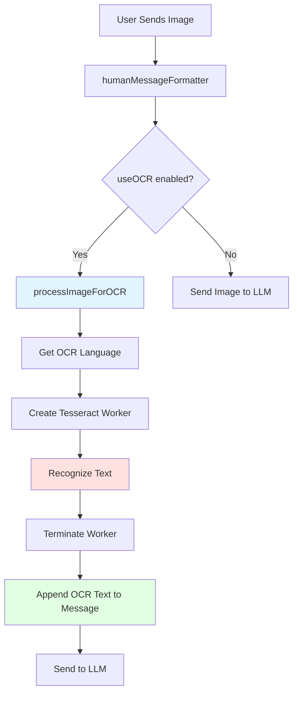
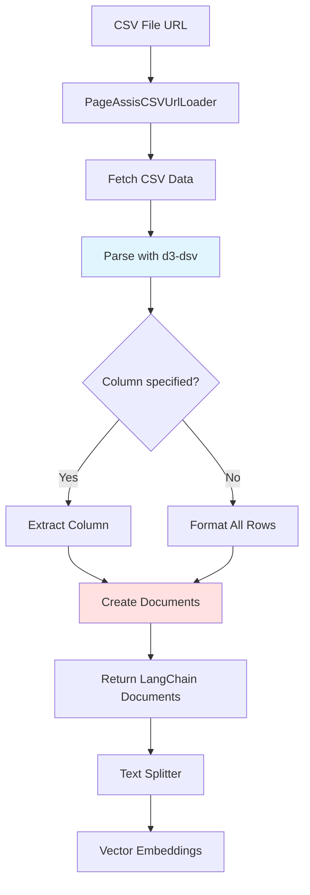

# OCR and CSV Support Implementation Documentation

## Table of Contents
1. [Overview](#overview)
2. [OCR Implementation](#ocr-implementation)
3. [CSV Support Implementation](#csv-support-implementation)
4. [Document Loaders Architecture](#document-loaders-architecture)
5. [File Upload Integration](#file-upload-integration)
6. [Dependencies](#dependencies)
7. [Implementation Guide](#implementation-guide)
8. [API Reference](#api-reference)

---

## Overview

PageAssist implements comprehensive file upload support with OCR (Optical Character Recognition) and CSV parsing capabilities. The system supports:

- **OCR**: 100+ languages via Tesseract.js with offline support
- **CSV**: Custom column selection and delimiter configuration
- **PDF**: Text extraction with page metadata
- **DOCX**: Microsoft Word document parsing
- **TXT/HTML**: Plain text and HTML content

### Key Features
- **Offline OCR**: Built-in English OCR without internet connection
- **Multi-language Support**: 100+ languages for OCR
- **Flexible CSV Parsing**: Support for custom separators and column extraction
- **LangChain Integration**: All loaders extend `BaseDocumentLoader`
- **Metadata Preservation**: Source, page numbers, line numbers tracked
- **Integration with Knowledge System**: Automatic embedding and vector storage

---

## OCR Implementation

### Architecture

PageAssist uses **Tesseract.js** (specifically `pa-tesseract.js` v5.1.1) for OCR functionality, integrated directly into the chat message processing pipeline.



### Core OCR Service

**File**: `src/services/ocr.ts`

```typescript
import { getDefaultOcrLanguage } from "@/data/ocr-language"
import { Storage } from "@plasmohq/storage"

const storage = new Storage()

// Get default OCR language from storage
export const getOCRLanguage = async () => {
  const data = await storage.get<string | undefined | null>("defaultOCRLanguage")
  if (!data || data.length === 0) {
    return getDefaultOcrLanguage()  // Returns 'eng-fast' for Chrome, 'eng' for Edge
  }
  return data
}

// Get OCR language for current chat session
export const getOCRLanguageToUse = async () => {
  const currentChatModelSettings = useStoreChatModelSettings.getState()
  
  // Check for session-specific language override
  if (currentChatModelSettings?.ocrLanguage) {
    return currentChatModelSettings.ocrLanguage
  }

  // Fall back to default
  const defaultOCRLanguage = await getOCRLanguage()
  return defaultOCRLanguage
}

// Check if OCR requires offline operation
export const isOfflineOCR = (lang: string) => {
  return lang !== "eng-fast"  // eng-fast is the offline English model
}
```

### OCR Processing Function

**File**: `src/utils/ocr.ts`

```typescript
import { getOCRLanguageToUse, isOfflineOCR } from "@/services/ocr"
import { createWorker } from "pa-tesseract.js"

export async function processImageForOCR(imageData: string): Promise<string> {
  try {
    // Get configured language
    const lang = await getOCRLanguageToUse()
    const isOCROffline = isOfflineOCR(lang)
    
    // Create Tesseract worker with custom paths
    const worker = await createWorker(lang, undefined, {
      workerPath: "/ocr/worker.min.js",          // Worker script path
      workerBlobURL: false,                       // Don't use blob URLs
      corePath: "/ocr/tesseract-core-simd.js",   // SIMD-optimized core
      errorHandler: (e) => console.error(e),
      langPath: !isOCROffline ? "/ocr/lang" : undefined  // Language data path
    })

    // Perform OCR
    const result = await worker.recognize(imageData)

    // Clean up
    await worker.terminate()

    return result.data.text
  } catch (error) {
    console.error("Error processing image for OCR:", error)
    return ""
  }
}
```

**Key Features**:
- **SIMD Acceleration**: Uses `tesseract-core-simd.js` for faster processing
- **Worker-based**: Runs in Web Worker to avoid blocking UI
- **Automatic Cleanup**: Terminates worker after processing
- **Error Handling**: Returns empty string on failure
- **Configurable Language**: Supports 100+ languages

### Language Support

**File**: `src/data/ocr-language.ts`

```typescript
// 100+ supported languages
const baseOcrLanguages = [
  { label: 'Afrikaans', value: 'afr' },
  { label: 'Arabic', value: 'ara' },
  { label: 'Bengali', value: 'ben' },
  { label: 'Chinese - Simplified', value: 'chi_sim' },
  { label: 'Chinese - Traditional', value: 'chi_tra' },
  { label: 'English', value: 'eng' },
  { label: 'French', value: 'fra' },
  { label: 'German', value: 'deu' },
  { label: 'Hindi', value: 'hin' },
  { label: 'Japanese', value: 'jpn' },
  { label: 'Korean', value: 'kor' },
  { label: 'Russian', value: 'rus' },
  { label: 'Spanish; Castilian', value: 'spa' },
  // ... 100+ more languages
];

// Export with offline English option
export const ocrLanguages = (
  import.meta.env.BROWSER === 'edge'
    ? baseOcrLanguages
    : [
        ...baseOcrLanguages,
        { label: 'English (Offline)', value: 'eng-fast' },  // Offline support
      ]
);

export const getDefaultOcrLanguage = () => {
  return import.meta.env.BROWSER === 'edge' ? 'eng' : 'eng-fast';
};
```

**Supported Languages** (partial list):
- **European**: English, Spanish, French, German, Italian, Portuguese, Russian, Polish, Dutch, Swedish, etc.
- **Asian**: Chinese (Simplified/Traditional), Japanese, Korean, Hindi, Bengali, Thai, Vietnamese, etc.
- **Middle Eastern**: Arabic, Hebrew, Persian, Turkish, etc.
- **Others**: 100+ total languages

**Offline Support**:
- `eng-fast`: Fast English OCR that works offline (non-Edge browsers)
- Embedded in extension, no internet required
- Other languages require downloading `.traineddata` files from `/ocr/lang`

### Integration with Chat Messages

**File**: `src/utils/human-message.tsx`

```typescript
import { HumanMessage, type MessageContent } from "@langchain/core/messages"
import { processImageForOCR } from "./ocr"

type HumanMessageType = {
  content: MessageContent
  model: string
  useOCR: boolean
}

export const humanMessageFormatter = async ({
  content,
  model,
  useOCR = false
}: HumanMessageType) => {
  const isCustom = isCustomModel(model)

  // Handle OCR for custom models (OpenAI-compatible without vision)
  if (isCustom) {
    if (typeof content !== "string" && content.length > 1) {
      if (useOCR) {
        // Extract image URL
        const imageUrl = content[1].image_url
        
        // Process image with OCR
        const ocrText = await processImageForOCR(imageUrl)
        
        // Format prompt with OCR text
        const ocrPROMPT = `${content[0].text}
        
[IMAGE OCR TEXT]
${ocrText}`
        
        return new HumanMessage({
          content: ocrPROMPT
        })
      }

      // Without OCR, reformat for vision models
      const newContent: MessageContent = [
        {
          type: "text",
          text: content[0].text
        },
        {
          type: "image_url",
          image_url: {
            url: content[1].image_url
          }
        }
      ]

      return new HumanMessage({
        content: newContent
      })
    }
  }

  // Handle OCR for Ollama models
  if (useOCR) {
    if (typeof content !== "string" && content.length > 1) {
      const ocrText = await processImageForOCR(content[1].image_url)
      
      const ocrPROMPT = `${content[0].text}

[IMAGE OCR TEXT]
${ocrText}`
      
      return new HumanMessage({
        content: ocrPROMPT
      })
    }
  }

  // Default: pass content as-is
  return new HumanMessage({
    content
  })
}
```

**OCR Flow**:
1. User sends message with image and `useOCR=true`
2. `humanMessageFormatter` detects image content
3. Calls `processImageForOCR(imageUrl)`
4. Appends OCR text to message under `[IMAGE OCR TEXT]` header
5. Sends text-only message to LLM (works with non-vision models)

**Use Cases**:
- **Text extraction from images**: Screenshots, photos of documents
- **Non-vision models**: Use OCR to enable "vision" for text-only models
- **Accessibility**: Extract text for further processing
- **Multilingual**: Extract text in 100+ languages

---

## CSV Support Implementation

### Architecture

CSV support is implemented through a custom LangChain document loader using **d3-dsv** (version 2) for robust parsing.



### CSV Loader Implementation

**File**: `src/loader/csv.ts`

```typescript
import { dsvFormat } from "d3-dsv"
import { BaseDocumentLoader } from "langchain/document_loaders/base"
import { Document } from "@langchain/core/documents"

export interface WebLoaderParams {
  url: string
  name: string
  options: {
    column?: string      // Extract specific column
    separator?: string   // Custom delimiter (default: comma)
  }
}

export class PageAssisCSVUrlLoader
  extends BaseDocumentLoader
  implements WebLoaderParams
{
  url: string
  name: string
  options: { column?: string; separator?: string }

  constructor({ url, name, options }: WebLoaderParams) {
    super()
    this.url = url
    this.name = name
    this.options = options || {}
  }

  // Parse CSV using d3-dsv
  public async parse(raw: string): Promise<string[]> {
    const { column, separator = "," } = this.options
    
    // Create parser with custom separator
    const psv = dsvFormat(separator)

    // Parse all rows
    let parsed = psv.parseRows(raw.trim())

    // Extract specific column if requested
    if (column !== undefined) {
      if (!parsed[0].includes(column)) {
        throw new Error(`ColumnNotFoundError: Column ${column} not found`)
      }

      const columnIndex = parsed[0].indexOf(column)
      return parsed.map((row) => row[columnIndex]!)
    }

    // Extract headers
    const headers = parsed[0]
    parsed = parsed.slice(1)

    // Format each row as "header: value" pairs
    return parsed.map((row) =>
      row.map((value, index) => `${headers[index]}: ${value}`).join("\n")
    )
  }

  async load(): Promise<Document<Record<string, any>>[]> {
    // Fetch CSV file
    const res = await fetch(this.url)

    if (!res.ok) {
      throw new Error(`Failed to fetch ${this.url}`)
    }

    const raw = await res.text()

    // Parse CSV
    const parsed = await this.parse(raw)
    
    // Create base metadata
    let metadata = { source: this.name, type: "csv" }
    
    // Validate parsed data
    parsed.forEach((pageContent, i) => {
      if (typeof pageContent !== "string") {
        throw new Error(
          `Expected string, at position ${i} got ${typeof pageContent}`
        )
      }
    })
    
    // Convert to LangChain Documents
    return parsed.map((pageContent, i) =>
      new Document({
        pageContent,
        metadata:
          parsed.length === 1
            ? metadata
            : {
                ...metadata,
                line: i + 1  // Track line number
              }
      })
    )
  }
}
```

**Key Features**:
- **d3-dsv Parser**: Robust CSV/TSV/DSV parsing
- **Custom Delimiters**: Support for comma, tab, pipe, or custom separators
- **Column Extraction**: Extract single column or all data
- **Header Preservation**: Format as "header: value" pairs
- **Line Tracking**: Metadata includes line numbers
- **URL-based**: Loads from data URLs (base64 encoded)

### CSV Parsing Examples

**Example 1: Parse entire CSV**

```typescript
const loader = new PageAssisCSVUrlLoader({
  name: "customers.csv",
  url: "data:text/csv;base64,bmFtZSxhZ2UsY2l0eQpKb2huLDMwLE5ZCkphbmUsMjUsU0Y=",
  options: {}
})

const docs = await loader.load()
// Result:
// [
//   Document({
//     pageContent: "name: John\nage: 30\ncity: NY",
//     metadata: { source: "customers.csv", type: "csv", line: 1 }
//   }),
//   Document({
//     pageContent: "name: Jane\nage: 25\ncity: SF",
//     metadata: { source: "customers.csv", type: "csv", line: 2 }
//   })
// ]
```

**Example 2: Extract specific column**

```typescript
const loader = new PageAssisCSVUrlLoader({
  name: "users.csv",
  url: csvDataUrl,
  options: {
    column: "email"  // Extract only email column
  }
})

const docs = await loader.load()
// Result: Documents containing only email values
```

**Example 3: Custom separator (TSV)**

```typescript
const loader = new PageAssisCSVUrlLoader({
  name: "data.tsv",
  url: tsvDataUrl,
  options: {
    separator: "\t"  // Tab-separated values
  }
})

const docs = await loader.load()
```

**Supported Separators**:
- `,` - Comma (CSV)
- `\t` - Tab (TSV)
- `|` - Pipe
- `;` - Semicolon
- Any custom string

---

## Document Loaders Architecture

All document loaders follow the same pattern, extending LangChain's `BaseDocumentLoader` class.

### Base Structure

```typescript
import { BaseDocumentLoader } from "langchain/document_loaders/base"
import { Document } from "@langchain/core/documents"

export class CustomLoader extends BaseDocumentLoader {
  // Constructor with parameters
  constructor(params: LoaderParams) {
    super()
    // Initialize properties
  }

  // Main load method
  async load(): Promise<Document[]> {
    // 1. Load raw content
    // 2. Parse/process
    // 3. Create Documents with metadata
    // 4. Return array of Documents
  }
}
```

### PDF Loader

**File**: `src/loader/pdf.ts`

```typescript
import { BaseDocumentLoader } from "langchain/document_loaders/base"
import { Document } from "@langchain/core/documents"

export interface WebLoaderParams {
  pdf: { content: string; page: number }[]  // Pre-parsed PDF pages
  url: string
}

export class PageAssistPDFLoader extends BaseDocumentLoader {
  pdf: { content: string; page: number }[]
  url: string

  constructor({ pdf, url }: WebLoaderParams) {
    super()
    this.pdf = pdf
    this.url = url
  }

  async load(): Promise<Document<Record<string, any>>[]> {
    const documents: Document[] = []

    // Create document for each page
    for (const page of this.pdf) {
      const metadata = { source: this.url, page: page.page }
      documents.push(new Document({ pageContent: page.content, metadata }))
    }

    // Return single document with all pages concatenated
    return [
      new Document({
        pageContent: documents.map((doc) => doc.pageContent).join("\n\n"),
        metadata: documents.map((doc) => doc.metadata)
      })
    ]
  }
}
```

**Features**:
- Accepts pre-parsed PDF content (from PDF.js)
- Preserves page numbers in metadata
- Concatenates pages with double newline

### DOCX Loader

**File**: `src/loader/docx.ts`

```typescript
import { BaseDocumentLoader } from "langchain/document_loaders/base"
import { Document } from "@langchain/core/documents"
import * as mammoth from "mammoth"

export interface WebLoaderParams {
  fileName: string
  buffer: ArrayBuffer  // DOCX file as ArrayBuffer
}

export class PageAssistDocxLoader extends BaseDocumentLoader {
  fileName: string
  buffer: ArrayBuffer

  constructor({ fileName, buffer }: WebLoaderParams) {
    super()
    this.fileName = fileName
    this.buffer = buffer
  }

  public async load(): Promise<Document[]> {
    // Extract raw text using mammoth.js
    const data = await mammoth.extractRawText({
      arrayBuffer: this.buffer
    })
    
    const text = data.value
    const meta = { source: this.fileName, type: "docx" }
    
    if (text) {
      return [new Document({ pageContent: text, metadata: meta })]
    }
    return []
  }
}
```

**Features**:
- Uses mammoth.js for DOCX parsing
- Extracts raw text (no formatting)
- Handles ArrayBuffer input

### TXT Loader

**File**: `src/loader/txt.ts`

```typescript
import { BaseDocumentLoader } from "langchain/document_loaders/base"
import { Document } from "@langchain/core/documents"

export interface WebLoaderParams {
  url: string
  name: string
}

export class PageAssisTXTUrlLoader extends BaseDocumentLoader {
  url: string
  name: string

  constructor({ url, name }: WebLoaderParams) {
    super()
    this.url = url
    this.name = name
  }

  async load(): Promise<Document[]> {
    const res = await fetch(this.url)

    if (!res.ok) {
      throw new Error(`Failed to fetch ${this.url}`)
    }

    const text = await res.text()
    const metadata = { source: this.name, type: "txt" }

    return [new Document({ pageContent: text, metadata })]
  }
}
```

**Features**:
- Simple text loading from URL
- Data URL support (base64 encoded)
- Minimal processing

### HTML Loader

**File**: `src/loader/html.ts`

```typescript
import { BaseDocumentLoader } from "langchain/document_loaders/base"
import { Document } from "@langchain/core/documents"
import TurndownService from "turndown"

export interface WebLoaderParams {
  html: string
  url: string
}

export class PageAssistHtmlLoader extends BaseDocumentLoader {
  html: string
  url: string

  constructor({ html, url }: WebLoaderParams) {
    super()
    this.html = html
    this.url = url
  }

  async load(): Promise<Document[]> {
    // Convert HTML to Markdown
    const turndownService = new TurndownService()
    const markdown = turndownService.turndown(this.html)
    
    const metadata = { source: this.url, type: "html" }

    return [new Document({ pageContent: markdown, metadata })]
  }
}
```

**Features**:
- Converts HTML to Markdown using Turndown
- Preserves structure and links
- Clean text extraction

---

## File Upload Integration

### Knowledge Base Processing

**File**: `src/libs/process-knowledge.ts`

```typescript
import { PageAssistVectorStore } from "./PageAssistVectorStore"
import { pageAssistEmbeddingModel } from "@/models/embedding"
import { getPageAssistTextSplitter } from "@/utils/text-splitter"

export const processKnowledge = async (msg: any, id: string): Promise<void> => {
  const knowledge = await getKnowledgeById(id)
  const ollamaUrl = await getOllamaURL()

  await updateKnowledgeStatus(id, "processing")

  // Initialize embedding model
  const ollamaEmbedding = await pageAssistEmbeddingModel({
    baseUrl: cleanUrl(ollamaUrl),
    model: knowledge.embedding_model
  })

  const textSplitter = await getPageAssistTextSplitter()

  // Process each document source
  for (const doc of knowledge.source) {
    if (!doc?.content || doc?.content === null) {
      continue
    }

    let loader
    let docs

    // Select appropriate loader based on file type
    if (doc.type === "pdf" || doc.type === "application/pdf") {
      loader = new PageAssistPDFUrlLoader({
        name: doc.filename,
        url: doc.content  // Base64 data URL
      })
    } 
    else if (doc.type === "csv" || doc.type === "text/csv") {
      loader = new PageAssisCSVUrlLoader({
        name: doc.filename,
        url: doc.content,
        options: {}  // Default: parse all columns
      })
    } 
    else if (
      doc.type === "docx" ||
      doc.type === "application/vnd.openxmlformats-officedocument.wordprocessingml.document"
    ) {
      loader = new PageAssistDocxLoader({
        fileName: doc.filename,
        buffer: await toArrayBufferFromBase64(doc.content)
      })
    } 
    else {
      // TXT/HTML fallback
      loader = new PageAssisTXTUrlLoader({
        name: doc.filename,
        url: doc.content
      })
    }

    // Load and split documents
    docs = await loader.load()
    const chunks = await textSplitter.splitDocuments(docs)

    // Create vector embeddings and store
    await PageAssistVectorStore.fromDocuments(chunks, ollamaEmbedding, {
      knownledge_id: knowledge.id,
      file_id: doc.source_id
    })
  }

  await updateKnowledgeStatus(id, "finished")
  await sendEmbeddingCompleteNotification()
}
```

**Processing Flow**:
1. Get knowledge base configuration
2. Initialize embedding model
3. Initialize text splitter
4. For each uploaded file:
   - Select appropriate loader based on MIME type
   - Load document content
   - Split into chunks
   - Generate embeddings
   - Store in vector database
5. Update status to "finished"

---

## Dependencies

### Required Packages

```json
{
  "dependencies": {
    "pa-tesseract.js": "^5.1.1",        // OCR engine
    "d3-dsv": "2",                      // CSV/TSV parser
    "mammoth": "^1.7.2",                // DOCX parser
    "@langchain/core": "latest",        // LangChain base classes
    "langchain": "latest",              // Document loaders
    "turndown": "latest"                // HTML to Markdown
  },
  "devDependencies": {
    "@types/d3-dsv": "^3.0.7"
  }
}
```

### File Structure

```
src/
├── services/
│   └── ocr.ts                 # OCR configuration service
├── utils/
│   ├── ocr.ts                 # OCR processing function
│   └── human-message.tsx      # Chat message formatter with OCR
├── data/
│   └── ocr-language.ts        # 100+ language definitions
├── loader/
│   ├── csv.ts                 # CSV loader
│   ├── pdf.ts                 # PDF loader
│   ├── pdf-url.ts             # PDF URL loader
│   ├── docx.ts                # DOCX loader
│   ├── txt.ts                 # TXT loader
│   └── html.ts                # HTML loader
├── libs/
│   └── process-knowledge.ts   # File processing pipeline
└── public/ocr/
    ├── worker.min.js          # Tesseract worker
    ├── tesseract-core-simd.js # SIMD-optimized core
    └── lang/                  # Language data (downloaded on demand)
```

---

## Implementation Guide

### Step 1: Install Dependencies

```bash
npm install pa-tesseract.js d3-dsv mammoth @langchain/core langchain turndown
npm install --save-dev @types/d3-dsv
```

### Step 2: Set Up Tesseract Files

1. Download Tesseract.js files:
   - `worker.min.js`
   - `tesseract-core-simd.js`

2. Place in `public/ocr/` directory

3. For offline support, include `eng.traineddata` in `public/ocr/lang/`

### Step 3: Implement OCR Service

```typescript
// services/ocr.ts
import { Storage } from "@plasmohq/storage"

const storage = new Storage()

export const getOCRLanguage = async () => {
  const data = await storage.get<string>("defaultOCRLanguage")
  return data || "eng-fast"  // Default to offline English
}

export const isOfflineOCR = (lang: string) => {
  return lang !== "eng-fast"
}
```

### Step 4: Implement OCR Processing

```typescript
// utils/ocr.ts
import { createWorker } from "pa-tesseract.js"
import { getOCRLanguage, isOfflineOCR } from "@/services/ocr"

export async function processImageForOCR(imageData: string): Promise<string> {
  try {
    const lang = await getOCRLanguage()
    const isOCROffline = isOfflineOCR(lang)
    
    const worker = await createWorker(lang, undefined, {
      workerPath: "/ocr/worker.min.js",
      workerBlobURL: false,
      corePath: "/ocr/tesseract-core-simd.js",
      errorHandler: (e) => console.error(e),
      langPath: !isOCROffline ? "/ocr/lang" : undefined
    })

    const result = await worker.recognize(imageData)
    await worker.terminate()

    return result.data.text
  } catch (error) {
    console.error("OCR Error:", error)
    return ""
  }
}
```

### Step 5: Implement CSV Loader

```typescript
// loader/csv.ts
import { dsvFormat } from "d3-dsv"
import { BaseDocumentLoader } from "langchain/document_loaders/base"
import { Document } from "@langchain/core/documents"

export class CSVLoader extends BaseDocumentLoader {
  constructor(
    private url: string,
    private name: string,
    private options: { column?: string; separator?: string } = {}
  ) {
    super()
  }

  async parse(raw: string): Promise<string[]> {
    const { column, separator = "," } = this.options
    const psv = dsvFormat(separator)
    let parsed = psv.parseRows(raw.trim())

    if (column) {
      const columnIndex = parsed[0].indexOf(column)
      if (columnIndex === -1) {
        throw new Error(`Column ${column} not found`)
      }
      return parsed.map((row) => row[columnIndex]!)
    }

    const headers = parsed[0]
    return parsed.slice(1).map((row) =>
      row.map((value, i) => `${headers[i]}: ${value}`).join("\n")
    )
  }

  async load(): Promise<Document[]> {
    const res = await fetch(this.url)
    if (!res.ok) throw new Error(`Failed to fetch ${this.url}`)
    
    const raw = await res.text()
    const parsed = await this.parse(raw)

    return parsed.map((content, i) =>
      new Document({
        pageContent: content,
        metadata: { source: this.name, type: "csv", line: i + 1 }
      })
    )
  }
}
```

### Step 6: Integrate with Chat

```typescript
// utils/human-message.tsx
import { HumanMessage } from "@langchain/core/messages"
import { processImageForOCR } from "./ocr"

export const formatChatMessage = async (
  content: any,
  useOCR: boolean
) => {
  if (useOCR && typeof content !== "string" && content.length > 1) {
    const imageUrl = content[1].image_url
    const ocrText = await processImageForOCR(imageUrl)
    
    const prompt = `${content[0].text}

[IMAGE OCR TEXT]
${ocrText}`
    
    return new HumanMessage({ content: prompt })
  }

  return new HumanMessage({ content })
}
```

### Step 7: Process Files

```typescript
// Process uploaded files
async function processFile(file: File, type: string) {
  let loader

  if (type === "csv") {
    const url = await fileToDataUrl(file)
    loader = new CSVLoader(url, file.name, {})
  } 
  else if (type === "pdf") {
    const pdfData = await parsePDF(file)
    loader = new PDFLoader(pdfData, file.name)
  }
  else if (type === "docx") {
    const buffer = await file.arrayBuffer()
    loader = new DOCXLoader(file.name, buffer)
  }

  const docs = await loader.load()
  
  // Split and embed
  const chunks = await textSplitter.splitDocuments(docs)
  const embeddings = await embeddingModel.embedDocuments(
    chunks.map(d => d.pageContent)
  )
  
  // Store in vector database
  await vectorStore.addVectors(embeddings, chunks)
}
```

---

## API Reference

### OCR API

```typescript
// Get OCR language setting
function getOCRLanguage(): Promise<string>

// Get OCR language for current session
function getOCRLanguageToUse(): Promise<string>

// Check if language requires network
function isOfflineOCR(lang: string): boolean

// Process image and extract text
function processImageForOCR(imageData: string): Promise<string>
```

### CSV Loader API

```typescript
class PageAssisCSVUrlLoader extends BaseDocumentLoader {
  constructor(params: {
    url: string
    name: string
    options?: {
      column?: string      // Extract specific column
      separator?: string   // Custom delimiter
    }
  })

  // Parse CSV text
  parse(raw: string): Promise<string[]>

  // Load and convert to Documents
  load(): Promise<Document[]>
}
```

### Document Loader API

```typescript
// All loaders extend this
abstract class BaseDocumentLoader {
  abstract load(): Promise<Document[]>
}

// Document structure
class Document {
  pageContent: string
  metadata: Record<string, any>
}
```

### Human Message Formatter API

```typescript
function humanMessageFormatter(params: {
  content: MessageContent
  model: string
  useOCR: boolean
}): Promise<HumanMessage>
```

---

## Usage Examples

### Example 1: OCR from Image in Chat

```typescript
// User sends image with text query
const message = {
  content: [
    { type: "text", text: "What's in this image?" },
    { type: "image_url", image_url: "data:image/png;base64,..." }
  ],
  useOCR: true
}

// Process message
const humanMsg = await humanMessageFormatter({
  content: message.content,
  model: "llama3.2",
  useOCR: true
})

// Result:
// HumanMessage({
//   content: "What's in this image?\n\n[IMAGE OCR TEXT]\nExtracted text from the image..."
// })
```

### Example 2: Load CSV File

```typescript
// Upload CSV file
const file = new File([csvData], "data.csv", { type: "text/csv" })
const dataUrl = await convertToDataUrl(file)

// Load with CSV loader
const loader = new PageAssisCSVUrlLoader({
  name: "data.csv",
  url: dataUrl,
  options: {}
})

const docs = await loader.load()

// Split and embed
const splitter = new RecursiveCharacterTextSplitter({
  chunkSize: 1000,
  chunkOverlap: 200
})

const chunks = await splitter.splitDocuments(docs)

// Create embeddings
const vectorStore = await Chroma.fromDocuments(
  chunks,
  embeddings
)
```

### Example 3: Extract Single CSV Column

```typescript
const loader = new PageAssisCSVUrlLoader({
  name: "emails.csv",
  url: csvDataUrl,
  options: {
    column: "email"  // Extract only email column
  }
})

const docs = await loader.load()
// Each document contains one email address
```

### Example 4: Multi-language OCR

```typescript
// Set OCR language to Japanese
await storage.set("defaultOCRLanguage", "jpn")

// Process Japanese image
const text = await processImageForOCR(japaneseImage)
// Returns Japanese text extracted from image
```

### Example 5: Custom CSV Separator

```typescript
const loader = new PageAssisCSVUrlLoader({
  name: "data.psv",
  url: dataUrl,
  options: {
    separator: "|"  // Pipe-separated values
  }
})

const docs = await loader.load()
```

---

## Performance Considerations

### OCR Optimization
1. **SIMD Acceleration**: Use `tesseract-core-simd.js` for 2-3x speed boost
2. **Worker Threads**: OCR runs in Web Worker, doesn't block UI
3. **Language Data**: Only load required languages (on-demand download)
4. **Offline Mode**: `eng-fast` works without network, faster initialization
5. **Image Size**: Resize large images before OCR for faster processing

### CSV Processing
1. **Streaming**: For large files, consider streaming parser
2. **Column Extraction**: Extract only needed columns to reduce data
3. **Chunk Size**: Balance between context and memory (default 1000)
4. **Separator Detection**: Auto-detect common separators

### File Upload
1. **Data URLs**: Use base64 data URLs for in-browser processing
2. **Compression**: Compress files before storage
3. **Batch Processing**: Process multiple files in parallel with concurrency limits
4. **Error Handling**: Graceful degradation on parse failures

---

## Troubleshooting

### OCR Issues

**Problem**: OCR not working
- Check Tesseract files are in `/public/ocr/`
- Verify `workerPath` and `corePath` are correct
- Check console for worker errors

**Problem**: Language not found
- Verify language code is correct (`eng`, `fra`, etc.)
- Check if `.traineddata` file exists in `/ocr/lang/`
- For offline: only `eng-fast` works without network

**Problem**: Slow OCR
- Use `eng-fast` for English (faster)
- Resize images to reasonable size (max 2000px)
- Use SIMD-optimized core

### CSV Issues

**Problem**: Parsing errors
- Verify CSV format is valid
- Check separator matches actual delimiter
- Ensure proper encoding (UTF-8)

**Problem**: Column not found
- Check column name matches header exactly
- Verify headers exist in first row
- Check for whitespace in names

---

## Summary

PageAssist implements comprehensive file upload support:

### OCR Features
- ✅ 100+ language support via Tesseract.js
- ✅ Offline English OCR (`eng-fast`)
- ✅ SIMD optimization for speed
- ✅ Web Worker isolation
- ✅ Integration with chat messages
- ✅ Support for non-vision models

### CSV Features
- ✅ Robust parsing with d3-dsv
- ✅ Custom delimiter support
- ✅ Column extraction
- ✅ Header preservation
- ✅ Line number tracking
- ✅ LangChain integration

### Document Loaders
- ✅ PDF (PDF.js)
- ✅ DOCX (mammoth.js)
- ✅ CSV (d3-dsv)
- ✅ TXT (plain text)
- ✅ HTML (Turndown)
- ✅ Unified interface via BaseDocumentLoader
- ✅ Metadata preservation
- ✅ Vector embedding integration

This implementation provides a complete foundation for file upload, OCR, and document processing that can be adapted to any LangChain-based RAG system.
