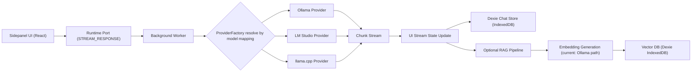

# Architecture

This document describes the current implementation as of `v0.6.0` and highlights tradeoffs, assumptions, and known constraints.

## 1) Entry Points

Primary runtime entry points:

- Sidepanel app: `src/sidepanel/index.tsx`
- Options app: `src/options/index.tsx`
- Background service worker: `src/background/index.ts`
- Content scripts: `src/contents/index.ts`, `src/contents/selection-button.tsx`

These map to extension pages generated by Plasmo.

## 2) System Responsibilities

### Sidepanel

- Chat interaction UX
- Session display and branch navigation
- Streaming state updates
- Local chat actions (edit, fork, delete, export)

### Options

- Provider configuration
- Model parameters
- Embedding/RAG configuration
- Feature toggles and diagnostics

### Background worker

- Provider resolution and streaming orchestration
- Model management handlers
- Embedding generation handlers for file chunks
- Browser-level APIs (DNR/CORS rules, context menu)

### Content scripts

- Selected-text capture
- Page extraction entrypoints for browser context workflows

## 3) Data Flow (UI -> Background -> Provider -> Stream -> Storage)

1. User sends prompt in sidepanel.
2. UI opens a runtime port (`MESSAGE_KEYS.OLLAMA.STREAM_RESPONSE`) to background.
3. Background receives `CHAT_WITH_MODEL` and resolves provider using model mapping.
4. Provider starts streaming tokens back to background.
5. Background relays chunks to UI through port messages.
6. UI applies optimistic updates and persists completed messages in local chat store.
7. Optional embedding pipelines index chat/file content for retrieval.

## 4) Model Selection and Provider Routing

### Model selection

- Selected model key is persisted under legacy key path (`STORAGE_KEYS.OLLAMA.SELECTED_MODEL`).
- Model list is built by querying all enabled providers in `useOllamaModels`.

### Provider integration

- Provider configs are persisted via `ProviderManager` (`ProviderStorageKey.CONFIG`).
- Default profiles: Ollama, LM Studio, llama.cpp.
- Per-model provider routing is stored via `ProviderStorageKey.MODEL_MAPPINGS`.
- Background routing is performed by `ProviderFactory.getProviderForModel(modelId)`.

## 5) Streaming Architecture

Streaming occurs over extension runtime ports:

- UI hook: `src/features/chat/hooks/use-ollama-stream.ts`
- Background handler: `src/background/handlers/handle-chat-with-model.ts`
- Abort/cancel handling: `abort-controller-registry`

Why this design:

- Runtime ports support continuous chunk delivery better than one-shot messages.
- Cancel support is clean via `AbortController` scoped to active stream keys.

Tradeoff:

- Message keys remain legacy-named (`OLLAMA.*`) even when provider is not Ollama.

## 6) Storage Architecture

### Active runtime storage

- Chat/session/files: Dexie (`src/lib/db.ts`)
- Vectors: Dexie (`src/lib/embeddings/db.ts`)
- Settings/provider config: Plasmo global storage

### SQLite status

- SQLite (`sql.js`) exists and a migration hook runs on startup.
- SQLite is currently not the primary runtime store for chat/session operations.
- This creates a dual-store architecture with migration complexity.

## 7) RAG/Embedding Architecture (Current)

- Embeddings are generated via Ollama embedding endpoint abstraction.
- Content is chunked and stored in vector Dexie DB.
- Query-time retrieval uses hybrid search with optional adaptive weighting.
- Pipeline includes diversity filtering and recency/feedback score hooks.

Important constraint:

- Re-ranker service exists but is disabled by default due Chrome extension CSP limits.

## 8) Why Background Worker Is Used

- Keeps provider network I/O and long-running operations off UI thread.
- Centralizes extension APIs that are unavailable or unsafe in UI contexts.
- Simplifies cancellation and stream lifecycle tracking.

## 9) Tradeoffs and Architectural Decisions

1. **Legacy naming retained for compatibility**
   - Pro: avoids migration breakage.
   - Con: causes confusion in multi-provider code paths.

2. **Dexie runtime + SQLite migration path**
   - Pro: stable current UX with incremental migration work.
   - Con: two persistence strategies increase maintenance overhead.

3. **Provider-agnostic chat with provider-specific management features**
   - Pro: fast rollout of multi-provider chat.
   - Con: uneven feature parity (pull/delete/version are Ollama-centric).

4. **Local retrieval pipeline over extension constraints**
   - Pro: privacy-preserving retrieval.
   - Con: CSP/performance limits prevent full in-browser model/reranker parity.

## 10) Assumptions and Constraints

Assumptions:

- User can run at least one provider endpoint.
- Endpoint URLs are reachable from extension context.
- Local resources are sufficient for selected models.

Constraints:

- Chrome extension CSP limits some WASM/worker ML paths.
- Firefox lacks Chrome DNR API behavior.
- Provider model naming collisions can cause ambiguous mapping behavior.

## 11) Known Risks / Technical Debt

- Naming debt across keys/hooks/files (`ollama-*` in multi-provider paths)
- Partial provider parity in model-management actions
- Dual persistence architecture during migration period
- Retrieval quality depends on chunking/threshold tuning and model quality

## 12) Near-Term Architecture Priorities

1. Normalize provider-agnostic naming.
2. Decide single source of truth for chat persistence.
3. Expand provider parity for management actions.
4. Improve retrieval observability and failure diagnostics.
