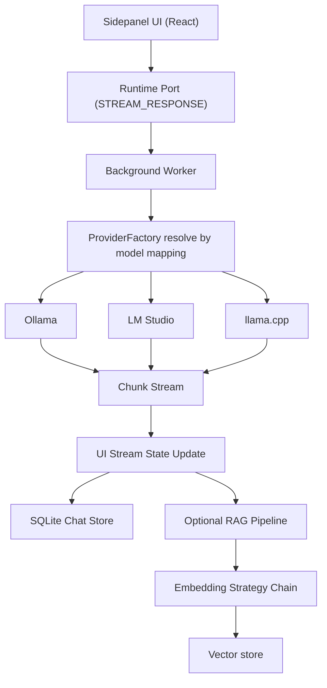

This document describes the current implementation and highlights tradeoffs, assumptions, and known constraints.

## Entry points

WXT auto-discovers entry points under `src/entrypoints/`. Each entry is a thin shell that delegates to a feature module elsewhere in `src/`, so the WXT-facing surface stays small and the actual logic lives where the rest of the code can import it.

| WXT entry point | Output type | Delegates to |
|---|---|---|
| `src/entrypoints/background.ts` | service worker | `src/background/index.ts` |
| `src/entrypoints/sidepanel/index.tsx` | extension page | `src/sidepanel/index.tsx` (React root) |
| `src/entrypoints/options/index.tsx` | extension page | `src/options/index.tsx` (React root) |
| `src/entrypoints/print/main.ts` | extension page | self-contained (print-to-PDF helper) |
| `src/entrypoints/content.ts` | content script (all URLs) | `src/contents/index.ts` (lazy-imported) |
| `src/entrypoints/selection-button.content.tsx` | content script (selection overlay) | self-contained (shadow-DOM UI) |

The WXT shells are intentionally minimal — `background.ts` is a 4-line import, `content.ts` is a 6-line lazy-import. Real work lives in the feature modules:

- `src/background/` — handler dispatch, provider streaming orchestration, `onInstalled` migrations
- `src/sidepanel/` — chat surface React app, opens the runtime port
- `src/options/` — settings React app
- `src/contents/` — selection capture, page extraction helpers, URL filtering

## System responsibilities

**Sidepanel**

- Chat interaction UX
- Session display and branch navigation
- Streaming state updates
- Local chat actions (edit, fork, delete, export)

**Options**

- Provider configuration
- Model parameters
- Embedding / RAG configuration
- Feature toggles and diagnostics

**Background worker**

- Provider resolution and streaming orchestration
- Model management handlers
- Embedding generation handlers for file chunks
- Browser-level APIs (DNR / CORS rules, context menu)

**Content scripts**

- Selected-text capture
- Page extraction entrypoints for browser-context workflows

## Data flow

1. User sends a prompt in the sidepanel.
2. UI opens a runtime port (`MESSAGE_KEYS.PROVIDER.STREAM_RESPONSE`) to the background.
3. Background receives `CHAT_WITH_MODEL` and resolves the provider using the model mapping.
4. Provider starts streaming tokens back to the background.
5. Background relays chunks to the UI through port messages.
6. UI applies optimistic updates and persists completed messages in the local chat store.
7. Optional embedding pipelines index chat / file content for retrieval.

## Model selection and provider routing

- The selected model key is persisted under the provider key path (`STORAGE_KEYS.PROVIDER.SELECTED_MODEL`) with legacy reads.
- The model list is built by querying all enabled providers in `useProviderModels`.
- Provider configs are persisted via `ProviderManager` (`ProviderStorageKey.CONFIG`).
- Default profiles: Ollama, LM Studio, llama.cpp, vLLM, KoboldCPP, and LocalAI.
- Per-model provider routing is stored via `ProviderStorageKey.MODEL_MAPPINGS`.
- Background routing is performed by `ProviderFactory.getProviderForModel(modelId)`.

## Streaming architecture

Streaming occurs over extension runtime ports:

- UI hook — `src/features/chat/hooks/use-chat-stream.ts`
- Background handler — `src/background/handlers/handle-chat-with-model.ts`
- Cancel handling — `abort-controller-registry`

Runtime ports support continuous chunk delivery better than one-shot messages, and cancellation is clean via `AbortController` scoped to active stream keys. Tradeoff: message keys are provider-named (`PROVIDER.*`) with legacy `OLLAMA.*` compatibility.

## Storage architecture

- **Chat / sessions / messages / files**: SQL WASM (`sql.js`) persisted to IndexedDB. The facade `src/lib/repositories/chat-history.ts` is the single entry point and now routes to SQLite only.
- **Vectors / embeddings**: still on Dexie + IndexedDB via `src/lib/embeddings/storage.ts`. Not yet migrated to SQLite.
- **Settings / provider config**: `@plasmohq/storage` via the `plasmoGlobalStorage` wrapper. Sync-safe settings use `chrome.storage.sync`; device-local keys use `chrome.storage.local`.
- **Export / restore**: ZIP bundles with versioned manifests; includes the chat SQLite blob plus Dexie dumps for vector embeddings and knowledge sets.

### Chat-history storage

The facade exposes one chat-history API while the implementation stays SQLite-only. Three guarantees follow:

1. **Durability**: SQLite writes are debounced 1s to IndexedDB, and explicit reset/export/unload paths force-flush via `flushSave()` where needed.
2. **Single source**: chat sessions, messages, branches, and file metadata read and write through one normalized SQLite schema.
3. **Export path**: full-data export includes the SQLite database blob, so chat history remains restorable without any Dexie chat dump.

See the [API reference](/reference/lib/repositories/chat-history/) for the full surface.

## RAG / embedding architecture

- Embeddings are generated via a browser-safe strategy chain.
- Content is chunked and indexed locally; chat history uses SQLite, while vector storage remains in IndexedDB via the embeddings storage layer.
- Query-time retrieval uses hybrid search with adaptive weighting.
- The pipeline includes diversity filtering and recency / feedback score hooks.
- Embeddings use a fallback chain: provider-native → shared model → background warmup → Ollama fallback.
- Background model preparation uses provider capabilities where available; Ollama remains the most complete management path.

:::note[Constraint]
There is no OCR pipeline. Cross-encoder reranking is browser/CSP-sensitive and depends on the bundled ONNX Runtime WASM path being available.
:::

## Why a background worker

- Keeps provider network I/O and long-running operations off the UI thread.
- Centralizes extension APIs that are unavailable or unsafe in UI contexts.
- Simplifies cancellation and stream lifecycle tracking.

## Tradeoffs and decisions

**Legacy naming retained for compatibility**

- *Pro:* avoids migration breakage.
- *Con:* causes confusion in multi-provider code paths.

**SQLite-only chat history**

- *Pro:* one normalized chat store, smaller bundle surface, simpler boot path, and clearer export semantics.
- *Con:* rollback now depends on full-data export or browser-level IndexedDB recovery, not a live Dexie chat fallback.

**Provider-agnostic chat with provider-specific management features**

- *Pro:* fast rollout of multi-provider chat.
- *Con:* uneven feature parity — pull / delete / version are Ollama-centric.

**Local retrieval pipeline over extension constraints**

- *Pro:* privacy-preserving retrieval.
- *Con:* CSP / performance limits prevent full in-browser model / reranker parity.

## Assumptions and constraints

**Assumptions**

- The user can run at least one provider endpoint.
- Endpoint URLs are reachable from extension context.
- Local resources are sufficient for selected models.

**Constraints**

- Chrome extension CSP limits some WASM / worker ML paths.
- Firefox lacks Chrome DNR API behavior.
- Provider model-naming collisions can cause ambiguous mapping behavior.

## Known risks and technical debt

- Legacy `ollama-*` keys retained for compatibility while provider naming becomes default.
- Partial provider parity in model-management actions.
- Dual persistence architecture during the migration period.
- Retrieval quality depends on chunking / threshold tuning and model quality.

## Desktop design notes

These are non-implementation notes for a hypothetical desktop port.

- The provider abstraction (factory / manager / types) is intentionally runtime-agnostic and can be reused in a desktop app.
- Provider identity metadata (icons, display names) should remain shared via `src/lib/providers/registry.ts`.
- Browser-only APIs (DNR, extension messaging) are already isolated in background handlers and would map to Electron main-process equivalents.
- Storage keys are provider-agnostic with legacy shims; a desktop app can reuse the same keys to migrate settings.

## Near-term priorities

1. Finish retiring legacy `ollama-*` naming where compatibility does not require it.
2. Migrate vector storage and knowledge sets off Dexie when the SQLite path is ready.
3. Expand provider parity for management actions.
4. Improve retrieval observability and failure diagnostics.
