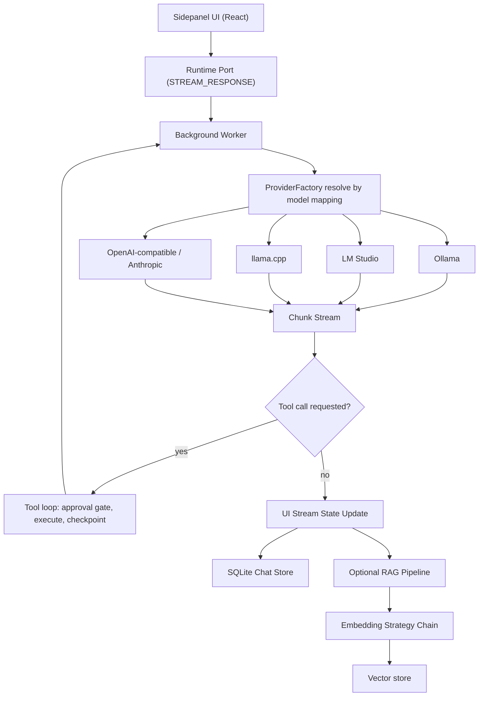

This document describes the current implementation and highlights tradeoffs, assumptions, and known constraints.

## Entry points

WXT auto-discovers entry points under `src/entrypoints/`. Each entry is a thin shell that delegates to a feature module elsewhere in `src/`, so the WXT-facing surface stays small and the actual logic lives where the rest of the code can import it.

| WXT entry point | Output type | Delegates to |
|---|---|---|
| `src/entrypoints/background.ts` | service worker | `src/background/index.ts` |
| `src/entrypoints/sidepanel/index.tsx` | extension page | `src/sidepanel/index.tsx` (React root) |
| `src/entrypoints/options/index.tsx` | extension page | `src/options/index.tsx` (React root) |
| `src/entrypoints/print/main.ts` | extension page | self-contained (print-to-PDF helper) |
| `src/entrypoints/content.ts` | runtime content script | `src/contents/index.ts` (injected only when page content is requested) |
| `src/entrypoints/selection-button.content.tsx` | manifest content script | tiny selection detector; asks the background to inject the UI |
| `src/entrypoints/selection-overlay.content.tsx` | runtime content script | shadow-DOM selection UI, injected into the requesting frame |

The WXT shells are intentionally minimal — `background.ts` is a 4-line import, `content.ts` is a 6-line lazy-import. Real work lives in the feature modules:

- `src/background/` — handler dispatch, provider streaming orchestration, `onInstalled` migrations
- `src/sidepanel/` — chat surface React app, opens the runtime port
- `src/options/` — settings React app
- `src/contents/` — selection capture, page extraction helpers, URL filtering

### Content-script loading boundary

Only `selection-button.js` is registered in the production manifest. It watches
for a valid selection without mounting React, loading translations, or injecting
styles. The first valid selection sends the allowlisted
`LOAD_SELECTION_OVERLAY` event; the background injects
`selection-overlay.js` into that exact tab frame.

The injected overlay has its own Tailwind source boundary and a generated
`selection_button`-only i18n asset for each supported locale. It fetches only
the active locale after injection, falls back to English, and treats a missing
locale asset as non-fatal. It does not carry the full application stylesheet or
translation trees.

Injection is a two-part handshake. The background acknowledges a versioned
request containing request, tab, frame, and document identity; the injected UI
then emits a ready event only after its configuration, locale, mount, and first
render complete. A failed injection or missing ready event releases the
bootstrap latch after three seconds, so a later selection can retry instead of
disabling the feature for the rest of the frame's lifetime.

The overlay also defers provider-model discovery until the user opens the
expanded panel. Showing the initial toolbar does not fetch the model catalog.

The page extractor is runtime-only. `requestPageContentWithRecovery()` first
tries the existing receiver, injects `content.js` when none exists, then retries.
This keeps Defuddle, Readability, transcript extraction, and enhanced extraction
logic off ordinary page startup.

Keep manifest content scripts small. They must not import the app UI system,
full locale tables, content parsers, provider implementations, or persistence
code.

### Bundle budgets

`pnpm bundle:report` measures the Chrome production build. `pnpm bundle:check`
and `pnpm bundle:check:firefox` enforce target-specific budgets after packaging.
CI packages and checks both browsers.

The enforced surface includes:

- unpacked and ZIP size;
- manifest content scripts and the selection bootstrap;
- the lazy selection overlay and background;
- initial sidepanel and options assets;
- the largest generated JavaScript chunk;
- byte-identical duplicate image, font, and WASM assets.

Current production measurements are approximately 9.12 MB unpacked / 3.11 MB
ZIP for Chrome and 11.43 MB unpacked / 4.14 MB ZIP for Firefox. The 5.6 kB
selection bootstrap is the only script registered on ordinary pages; the
649.7 kB overlay is runtime-only. These are regression baselines, not targets
to fill.

Firefox is larger mainly because its MV2 persistence owner ships the
`sqlite3-worker1` and `chat-db-worker` assets as roughly 1.3–1.4 MB files,
whereas the Chromium MV3 owner produces roughly 208–224 kB worker assets. The
shared application chunks are nearly the same size. Removing shared features
would therefore not fix most of the browser delta.

Translations load as one locale chunk at a time through
`src/i18n/locale-loader.ts`; extension-store metadata under `public/_locales`
continues to be generated from the same locale source files.

The options shell keeps the default General tab eager and lazy-loads the
inactive settings tabs. Backup/restore loads its ZIP implementation only when
an import or export starts. These boundaries keep inactive settings and export
code out of the initial options-page graph without delaying the first tab.

Store icons are emitted at their requested 16, 32, 48, 64, and 128 pixel sizes
instead of packaging one oversized source icon. PDF.js and its approximately
1.3 MB worker remain intentional: PDF extraction still needs them, and the
worker is already isolated from ordinary page startup. The legacy `sql.js`
WASM also remains intentional until direct-upgrade and rollback compatibility
can safely stop using the fallback reader.

## System responsibilities

**Sidepanel**

- Chat interaction UX
- Session display and branch navigation
- Streaming state updates
- Local chat actions (edit, fork, delete, export)

**Options**

- Provider configuration
- Model parameters
- Embedding / RAG configuration
- Feature toggles and diagnostics

**Background worker**

- Provider resolution and streaming orchestration
- Tool-loop execution, approval gating, and loop checkpointing
- RPC server for provider configuration, connection tests, and diagnostics
- Model management handlers
- Embedding generation handlers for file chunks
- Browser-level APIs (DNR / CORS rules, context menu, alarms)

**Content scripts**

- Selected-text capture
- Page extraction entrypoints for browser-context workflows

## Data flow

1. User sends a prompt in the sidepanel.
2. UI opens a runtime port (`MESSAGE_KEYS.PROVIDER.STREAM_RESPONSE`) to the background.
3. Background receives `CHAT_WITH_MODEL` and resolves the provider using the model mapping.
4. Provider starts streaming tokens back to the background.
5. If the model requests a tool, the background runs the tool loop — gating on approval where the tool's risk requires it, checkpointing at each boundary — and continues the stream with the tool result appended.
6. Background relays chunks to the UI through port messages.
7. UI applies optimistic updates and persists completed messages in the local chat store.
8. Optional embedding pipelines index chat / file content for retrieval.

```mermaid
flowchart TD
    A["Sidepanel UI (React)"] --> B["Runtime Port (STREAM_RESPONSE)"]
    B --> C["Background Worker"]
    C --> D["ProviderFactory resolve by model mapping"]
    D --> E["Ollama"]
    D --> F["LM Studio"]
    D --> G["llama.cpp"]
    D --> N["OpenAI-compatible / Anthropic"]
    E --> H["Chunk Stream"]
    F --> H
    G --> H
    N --> H
    H --> T{"Tool call requested?"}
    T -->|yes| U["Tool loop: approval gate, execute, checkpoint"]
    U --> C
    T -->|no| I["UI Stream State Update"]
    I --> J["SQLite Chat Store"]
    I --> K["Optional RAG Pipeline"]
    K --> L["Embedding Strategy Chain"]
    L --> M["Vector store"]
```

Configuration traffic does not use this path — see [Provider RPC boundary](#provider-rpc-boundary).

## Provider RPC boundary

Token streaming uses runtime ports, but everything else that crosses the extension-page ↔ background boundary — reading provider configuration, testing a connection, listing models, running diagnostics — goes through a versioned request/response contract in `src/protocol/` rather than ad-hoc message keys.

| File | Role |
|---|---|
| `src/protocol/rpc.ts` | Protocol version, `RpcMethod` / `RpcErrorCode` enums, request and response envelopes |
| `src/protocol/provider-rpc.ts` | Per-method request/result schemas and the typed `RpcMap` |
| `src/protocol/diagnostics-rpc.ts` | Diagnostics method schemas |
| `src/protocol/rpc-registry.ts` | Per-method schema, sender policy, timeout, and operation metadata |
| `src/protocol/extension-client.ts` | Validated client used by extension pages |
| `src/background/rpc-server.ts` | Authorization, validation, dispatch, and safe error mapping |
| `src/lib/providers/provider-rpc-service.ts` | Background-owned implementation of the provider operations |

Why a separate boundary instead of more message keys:

- **Both ends validate.** A method is registered once with its schemas; neither side trusts the other's payload shape.
- **Errors are enumerated, not stringly typed.** `invalid_request`, `forbidden`, `not_found`, `provider_failed`, `timeout`, `internal`. Results carry i18n message keys plus safe fallback text, never raw provider errors that might embed a credential.
- **Queries have no write side effects.** Methods registered as queries must not persist anything, so a client timeout cannot commit stale state. Derived state is persisted only after the caller receives and accepts the result.
- **Cancellation is end-to-end.** A client timeout sends `app-rpc-cancel`; the server aborts the matching request and the provider's model-discovery `fetch` receives that `AbortSignal`.

Legacy `MESSAGE_KEYS` handlers may delegate to the RPC service during migration, but new provider request/response work is added here.

## Model capabilities

Feature availability is resolved per selected model. The capability layer covers text chat, image input, tool calling, reasoning output, embeddings, and context length.

Resolution runs in four layers, highest priority first:

1. **User override** — what the user set by hand in the model menu. Always wins.
2. **Empirical probe** — `capability-probe.ts` sends one trivial tool-call request and records whether the model actually emitted a native tool call. This is evidence from the real server, so it beats static metadata, but never the user's word. It is how models on providers with no capability metadata (effectively everything OpenAI-compatible) get `toolCalling` detected without hand-toggling.
3. **Model metadata** — real tags where the provider reports them (Ollama `/api/show`), or partial inference (LM Studio model type).
4. **Provider default** — the model itself was not inspected.

Each resolved capability carries a confidence value (`high` / `medium` / `low`) alongside its source, so the UI can distinguish "this model reports vision" from "we assumed it."

This keeps capability-sensitive UI from guessing. For example:

- Image attach is enabled only for models that resolve `vision: true`.
- Internal tools are offered only to models that resolve `toolCalling: true`.
- Embedding models are kept out of normal chat-model selectors.

Users can override capabilities from the model menu when a provider cannot report them reliably.

## Tool calling architecture

Tool calling is handled in the background worker, between provider streaming and UI persistence.

1. The handler resolves the selected model and checks whether tool calling is enabled for that model.
2. Tool definitions are loaded from the `ToolRegistry`.
3. The provider receives the chat request with native tool definitions.
4. If the model requests a tool, the stream loop executes it locally and appends a tool result to the working provider history.
5. The loop continues until the model returns a normal answer or hits the iteration cap.

Models that cannot emit native tool calls are handled by a text protocol in `src/lib/tools/non-native/`, which parses tool invocations out of the model's prose. The two loops (`stream-chat-with-tools.ts` and `stream-chat-with-non-native-tools.ts`) are separate implementations with the same lifecycle, approval, and checkpoint contract.

Tool results are trimmed before they are fed back to the model. The UI persists the final assistant answer and trace metadata, not the intermediate tool messages.

### Internal tools

Tools are registered in `src/lib/tools/internal/internal-tool-source.ts` — appending to that list is the whole registration step; the registry, adapters, loop, and trace UI need no change. Browser-dependent tools check both API support and the live optional permission before they are offered.

| Tool | Risk | Purpose |
|---|---|---|
| `rag_search` | low | Search local chat memory / indexed conversation context. |
| `file_search` | low | Search uploaded and indexed files. |
| `current_tab` | low | Read the active tab's extracted text, including supported video transcripts. |
| `list_tabs` | low | List readable open tabs with current ids, titles, and URLs. |
| `read_tab` | low | Read a specific open tab by id or title/URL query. Stale ids are refreshed and can fall back to the active readable tab. |
| `list_tab_groups` | low | List the browser's tab groups. |
| `read_tab_group` | low | Read the readable tabs inside one group. |
| `selected_text` | low | Use the most recent page selection captured by the extension. |
| `list_reminders` | low | List pending reminders. |
| `web_search` | medium | Search the live web through the configured search provider. |
| `get_recent_history` | medium | Query recent browsing history. |
| `search_bookmarks` | medium | Search saved bookmarks. |
| `list_recently_closed` | medium | List recently closed tabs and windows. |
| `list_synced_sessions` | medium | List tabs open on the user's other synced devices. |
| `restore_session` | medium | Reopen recently closed tabs or windows. Returns no page content, but it acts on the browser and leaves a visible trace. |
| `capture_screenshot` | medium | Capture the visible area of the active tab. |
| `save_artifact` | medium | Persist a generated artifact to the chat. |
| `schedule_reminder` | medium | Schedule a reminder via browser alarms. |
| `cancel_reminder` | high | Permanently remove a pending reminder. Destructive, so it is confirmed on every call. |

### Approval and risk policy

There is no single hardcoded confirmation flag. Each tool declares a risk level and the policy in `src/lib/tools/approval/` derives the prompt from it:

| Risk | Policy |
|---|---|
| `low` | Runs automatically; never prompts. |
| `medium` | Confirmed once per chat — an approval grants the rest of that chat. |
| `high` | Confirmed on every call, with "always allow" offered. |
| `critical` | Always confirmed; no grant of any scope is offered. |

Grants are keyed per **tool × origin**, not per tool, so an approval for one site never silently covers another. Only `http(s)` origins are grantable; internal pages (`chrome://`, `about:`, `moz-extension://`) are already blocked by the tab-access filters, and a grant for them would be meaningless — a missing or unparseable origin means "no grant applies", never a fallback to the wildcard. Persisted "always" grants live in `approval-grants.ts`; "this chat" grants live in a background session map that dies with the worker.

### Loop durability across worker restarts

MV3 can terminate the service worker mid-turn, including while a tool loop is waiting on the user. Active loops therefore checkpoint into the SQLite `tool_loop_runs` table at every model, tool, and approval boundary, and force-flush before awaiting an approval — the one point where the loop can sit idle long enough to be killed.

The sidepanel reconnects using the same request id after a restart and the loop resumes from its checkpoint. Completed runs delete their checkpoint; `startup.ts` prunes stale ones on boot. This checkpoint/reconnect pair is a contract — changing tool execution without preserving it turns a worker restart back into a lost turn.

### Web search adapter seam

Web search is intentionally provider-agnostic at the model boundary. The model sees only `web_search({ query, count? })`; the backend is resolved from device-local settings at runtime.

Implementation paths:

- `src/lib/tools/web-search/types.ts` defines `WebSearchBackend`, `WebSearchProviderConfig`, and normalized `WebSearchResult`.
- `src/lib/tools/web-search/backends/` contains provider adapters for SearXNG, Brave Search, and Tavily.
- `src/lib/tools/web-search/registry.ts` is the backend registry/factory seam.
- `src/lib/tools/web-search/web-search-tool-source.ts` exposes the tool only when enabled and valid.
- `src/features/web-search/` owns the settings UI and chat-toolbar toggle.

Provider behavior:

| Provider | Request shape | Result cap behavior |
|---|---|---|
| SearXNG | `GET /search?q=...&format=json&pageno=N&safesearch=...` | No API-side count; fetch configured pages, de-dupe, then slice locally. |
| Brave Search | `GET https://api.search.brave.com/res/v1/web/search` with `X-Subscription-Token` | Sends `count`. |
| Tavily | `POST https://api.tavily.com/search` with bearer auth | Sends `max_results`. |

References:

- [SearXNG Search API](https://docs.searxng.org/dev/search_api.html)
- [Brave Search API](https://api-dashboard.search.brave.com/app/documentation/web-search/responses)
- [Tavily Search API](https://docs.tavily.com/documentation/api-reference/endpoint/search)

Search titles and snippets are untrusted data. The tool strips HTML, caps snippets and total output, keeps API keys out of logs, and asks the model to cite returned URLs for current facts.

## Image input

Images are stored as chat attachments and routed only when the selected model supports vision. Provider adapters translate the same chat message into each provider's expected wire format:

- Ollama receives base64 image payloads through its native `images` field.
- OpenAI-compatible providers receive `image_url` content parts.
- Anthropic receives native image content blocks through the Messages API.

Images reuse the existing file metadata path for local persistence and preview display, so no separate image-history store is needed.

## Model selection and provider routing

- The selected model key is persisted under the provider key path (`STORAGE_KEYS.PROVIDER.SELECTED_MODEL`) with legacy reads.
- The model list is built by querying all enabled providers in `useProviderModels`.
- Provider configs are persisted via `ProviderManager` (`ProviderStorageKey.CONFIG`).
- Built-in profiles: Ollama, LM Studio, and llama.cpp. User-added configs keep wire protocol separate from service profile, so OpenRouter uses the OpenAI-compatible wire without being identified as OpenAI, and generic Anthropic-compatible endpoints avoid Anthropic-hosted credential/header assumptions.
- Per-model provider routing is stored via `ProviderStorageKey.MODEL_MAPPINGS`.
- Background routing is performed by `ProviderFactory.getProviderForModel(modelId)`.

### Credential separation

API keys are never stored inside the provider config record. `provider-secret-store.ts` splits each config on write: the public fields go to the normal provider config key, and `apiKey` is stripped into a separate device-local secret map under `STORAGE_KEYS.PROVIDER.SECRETS`. Keys are re-attached only when a provider instance is actually constructed.

Two consequences fall out of that split:

- Secrets stay on the device. Provider configuration can ride `chrome.storage.sync` without syncing credentials, and diagnostics or RPC results that serialize a provider config carry no key.
- The split write is journaled. Writing two storage keys is not atomic, so the store records a journal entry first and replays it on next boot if a crash lands between the two writes — otherwise an interrupted save could orphan a key or leave a config pointing at a secret that was never written.

## Streaming architecture

Streaming occurs over extension runtime ports:

- UI hook — `src/features/chat/hooks/use-chat-stream.ts`
- Background handler — `src/background/handlers/handle-chat-with-model.ts`
- Cancel handling — `abort-controller-registry`

Runtime ports support continuous chunk delivery better than one-shot messages, and cancellation is clean via `AbortController` scoped to active stream keys. Tradeoff: message keys are provider-named (`PROVIDER.*`) with legacy `OLLAMA.*` compatibility.

### Provider reasoning replay

Some providers require that reasoning produced in an earlier turn be handed back verbatim to continue a tool loop — Anthropic's signed thinking and redacted-thinking blocks, OpenRouter's `reasoning_details`. These are opaque, provider-owned values: they cannot be regenerated, reordered, or paraphrased without invalidating the continuation.

They are therefore kept apart from the reasoning text the UI displays. `ChatMessage.thinking` is display-only and safe to render or truncate. `ChatMessage.replayArtifact` is a versioned, size-capped, schema-validated record of the opaque blocks, stored in its own SQLite column and carried through tool-loop checkpoints in original block order.

Before replay, the artifact's `providerId` and `model` are checked against the current turn — a block signed by one provider is not valid input to another. An artifact that fails validation surfaces as a "retry this turn" error rather than being sent anyway. Opaque block contents are never rendered and never logged.

## Storage architecture

- **Chat / sessions / messages / files**: SQL WASM (`sql.js`) persisted to IndexedDB. The facade `src/lib/repositories/chat-history.ts` is the single entry point and now routes to SQLite only.
- **Vectors / embeddings**: still on Dexie + IndexedDB via `src/lib/embeddings/storage.ts`. Not yet migrated to SQLite.
- **Settings / provider config**: `@plasmohq/storage` via the `plasmoGlobalStorage` wrapper. Sync-safe settings use `chrome.storage.sync`; device-local keys use `chrome.storage.local`.
- **Settings IA**: six intent tabs — General, Models, Knowledge, Browser, Privacy, and Help. Legacy deep links resolve through the settings registry.
- **RAG splitting**: files, chat memory, and live page sources share `src/lib/embeddings/chunker.ts`; the retired parallel text-splitter tree must not be restored.
- **Session organization**: tags are JSON stored in the SQLite `sessions.tags` column and exposed through the chat-session store. Pinned state and per-chat system prompts live on the same table.
- **Tool-loop checkpoints**: the SQLite `tool_loop_runs` table, written at loop boundaries so an MV3 worker restart does not lose an in-flight turn.
- **Schema changes**: forward-only migrations under `src/lib/sqlite/migrations/`, applied by `migration-runner.ts`. Add a column with a migration rather than editing the base schema.
- **Export / restore**: ZIP bundles with versioned manifests; includes the chat SQLite blob plus Dexie dumps for vector embeddings and knowledge sets.

### Chat-history storage

The facade exposes one chat-history API while the implementation stays SQLite-only. Three guarantees follow:

1. **Durability**: SQLite writes are debounced 1s to IndexedDB, and explicit reset/export/unload paths force-flush via `flushSave()` where needed.
2. **Single source**: chat sessions, messages, branches, and file metadata read and write through one normalized SQLite schema.
3. **Export path**: full-data export includes the SQLite database blob, so chat history remains restorable without any Dexie chat dump.

See the [API reference](/reference/lib/repositories/chat-history/) for the full surface.

## RAG / embedding architecture

- Embeddings are generated via a browser-safe strategy chain.
- Content is chunked and indexed locally; chat history uses SQLite, while vector storage remains in IndexedDB via the embeddings storage layer.
- Query-time retrieval uses hybrid search with adaptive weighting.
- The pipeline includes diversity filtering and recency / feedback score hooks.
- Embeddings use a fallback chain: provider-native → shared model → background warmup → Ollama fallback.
- Background model preparation uses provider capabilities where available; Ollama remains the most complete management path.

### Reranking

Reranking is on by default and is a **cosine-similarity re-scorer**, not a cross-encoder. After hybrid search returns candidates, `src/lib/embeddings/reranker.ts` re-scores them by embedding cosine similarity against the query embedding, giving a semantic-only ordering independent of the keyword weight used in stage 1.

A real cross-encoder was attempted via transformers.js / ONNX Runtime and abandoned: MV3's CSP blocked the path it needed, and neither library is a dependency of this project. `config.ts` still accepts the legacy `transformers-js` and `onnxruntime-web` backend strings, purely as a migration shim that collapses them to `cosine`.

:::note[Constraint]
There is no OCR pipeline, and no cross-encoder reranking. Retrieval precision comes from chunking, hybrid weighting, and cosine re-scoring only.
:::

## Why a background worker

- Keeps provider network I/O and long-running operations off the UI thread.
- Centralizes extension APIs that are unavailable or unsafe in UI contexts.
- Simplifies cancellation and stream lifecycle tracking.

## Tradeoffs and decisions

**Legacy naming retained for compatibility**

- *Pro:* avoids migration breakage.
- *Con:* causes confusion in multi-provider code paths.

**SQLite-only chat history**

- *Pro:* one normalized chat store, smaller bundle surface, simpler boot path, and clearer export semantics.
- *Con:* rollback now depends on full-data export or browser-level IndexedDB recovery, not a live Dexie chat fallback.

**Provider-agnostic chat with provider-specific management features**

- *Pro:* fast rollout of multi-provider chat.
- *Con:* uneven feature parity — pull / delete / version are Ollama-centric.

**Local retrieval pipeline over extension constraints**

- *Pro:* privacy-preserving retrieval.
- *Con:* CSP / performance limits prevent full in-browser model / reranker parity.

## Assumptions and constraints

**Assumptions**

- The user can run at least one provider endpoint.
- Endpoint URLs are reachable from extension context.
- Local resources are sufficient for selected models.

**Constraints**

- Chrome extension CSP limits some WASM / worker ML paths.
- Firefox lacks Chrome DNR API behavior.
- Provider model-naming collisions can cause ambiguous mapping behavior.

## Known risks and technical debt

- Legacy `ollama-*` keys retained for compatibility while provider naming becomes default, and some legacy `MESSAGE_KEYS` handlers still carry provider work that belongs on the RPC boundary.
- Partial provider parity in model-management actions.
- Two storage engines: chat history is SQLite-only, but vectors and knowledge sets are still Dexie. The Dexie *chat* fallback is retired — this is a split by domain, not a migration in progress.
- `sql.js` ships in the production bundle. Replacing it is scoped work, not a permanent choice.
- Retrieval quality depends on chunking / threshold tuning and model quality.

## Desktop design notes

These are non-implementation notes for a hypothetical desktop port.

- The provider abstraction (factory / manager / types) is intentionally runtime-agnostic and can be reused in a desktop app.
- Provider identity metadata (icons, display names) should remain shared via `src/lib/providers/registry.ts`.
- Browser-only APIs (DNR, extension messaging) are already isolated in background handlers and would map to Electron main-process equivalents.
- Storage keys are provider-agnostic with legacy shims; a desktop app can reuse the same keys to migrate settings.

## Near-term priorities

1. Move the remaining legacy `MESSAGE_KEYS` provider handlers onto the RPC boundary, and retire `ollama-*` naming where compatibility does not require it.
2. Migrate vector storage and knowledge sets off Dexie when the SQLite path is ready.
3. Expand provider parity for management actions.
4. Improve retrieval observability and failure diagnostics.
